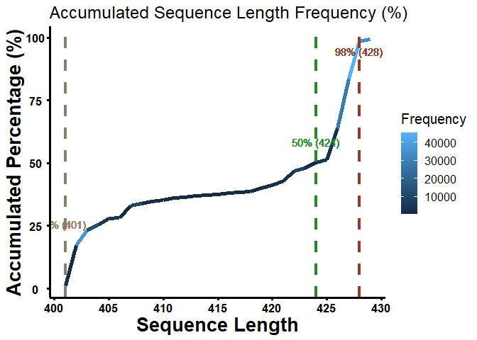
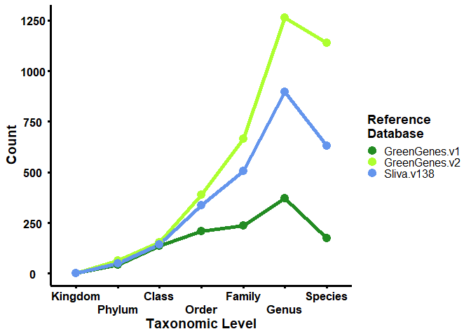

# The UK Crop Microbiome Cryobank - How-to Guide: sequence length selection & taxonomic Levels of reference databases

## Trimming and optimal sequence length selection.

We used the longest possible length to find the highest accumulated
percentage of the merged sequence length frequency. It assists in
trimming out sequences of lower quality and minimises the error rate for
the sequence analysis steps in DADA2. This process is part of the events
in preprocessing and to prevent “over-merging”.

The denoise setting is for DADA2: qiime dada2 denoise-paired  
-i-demultiplexed-seqs demux.qza  
–p-trunc-len-f 233  
–p-trunc-len-r 226  
–p-trim-left-f 0  
–p-trim-left-r 0  
–p-max-ee-f 3  
–p-max-ee-r 2  
–p-n-threads 8  
–o-representative-sequences rep-seqs.qza  
–o-table table.qza

The original “16s\_length\_distribution.RData” extracted from
“rep-seqs-with-phyla-no-mitochondria-no-chloroplast.qzv”

    # Load the necessary libraries
    library("ggplot2")     
    library("scales")     

    # Load the merged sequence data
    load("16s_length_distribution.RData")

### Calculate the length and frequency of each sequence

    # Calculate the length of each sequence
    # This step adds a new column to the data frame that contains the length of each sequence
    df$SequenceLength <- apply(df, 1, function(x) nchar(x[['Sequence']]))

    # Sort the data frame by SequenceLength
    # This step sorts the data frame in ascending order of sequence length
    df <- df[order(df$SequenceLength), ]

    # Calculate the frequency of each sequence length
    # This step calculates the frequency of each sequence length and stores the result in a new data frame
    df2 <- table(df$SequenceLength)

    # Create a data frame for plotting
    # This step creates a new data frame that contains the sequence length and its corresponding frequency
    plot_df <- data.frame(SequenceLength = as.numeric(names(df2)), Frequency = as.numeric(df2))

    # Calculate the accumulated percentage
    # This step calculates the accumulated percentage of the sequence length frequency
    plot_df$AccumulatedPercentage <- cumsum(plot_df$Frequency) / sum(plot_df$Frequency) * 100

    # Filter the data frame
    # This step filters the data frame to include only rows where the accumulated percentage is between 0.5% and 99.5%
    plot_df2 <- plot_df[plot_df$AccumulatedPercentage >= 0.5 & plot_df$AccumulatedPercentage <= 99.5, ]

### Plotting

    # Create a line graph
    # This step creates a line graph of the accumulated sequence length frequency
    p = ggplot(plot_df2, aes(x = SequenceLength, y = AccumulatedPercentage)) +
      labs(x = "Sequence Length", y = "Accumulated Percentage (%)", 
           title = "Accumulated Sequence Length Frequency (%)") +
      theme_classic() + 
      geom_line(aes(color = Frequency), size = 2) +
      theme(
        text = element_text(size = 15, colour = "black"), 
        axis.ticks = element_line(colour = "black", size = 1.1),
        axis.line = element_line(colour = 'black', size = 1.1),
        axis.text.x = element_text(colour = "black", angle = 0, hjust = 0.5, 
                                   size = 13, face = "bold"),
        axis.text.y = element_text(colour = "black", angle = 0, hjust = 0.5, 
                                   size = 13, face = "bold"),
        axis.title.y = element_text(color = "black", size = 20, face = "bold"), 
        axis.title.x = element_text(color = "black", size = 20, face = "bold"))

    # Add vertical lines and text labels at the 2%, 50%, and 98% points
    # This step adds vertical lines and text labels at the 2%, 50%, and 98% points of the accumulated sequence length frequency
    p + geom_vline(aes(xintercept = plot_df$SequenceLength[which.min(abs(plot_df$AccumulatedPercentage - 2))]), 
                   linetype="dashed", size = 1.5, color = "wheat4") +
      geom_text(aes(x = plot_df$SequenceLength[which.min(abs(plot_df$AccumulatedPercentage - 2))], y = 2, 
                    label = paste("2% (", plot_df$SequenceLength[which.min(abs(plot_df$AccumulatedPercentage - 2))], ")", sep = "")), 
                vjust = -6.5, color = "wheat4") +
      geom_vline(aes(xintercept = plot_df$SequenceLength[which.min(abs(plot_df$AccumulatedPercentage - 50))]), 
                 linetype="dashed", size = 1.5, color = "forestgreen") +
      geom_text(aes(x = plot_df$SequenceLength[which.min(abs(plot_df$AccumulatedPercentage - 50))], y = 50, 
                    label = paste("50% (", plot_df$SequenceLength[which.min(abs(plot_df$AccumulatedPercentage - 50))], ")", sep = "")), 
                vjust = -2, color = "forestgreen") +
      geom_vline(aes(xintercept = plot_df$SequenceLength[which.min(abs(plot_df$AccumulatedPercentage - 98))]), 
                 linetype="dashed", size = 1.5, color = "coral4") +
      geom_text(aes(x = plot_df$SequenceLength[which.min(abs(plot_df$AccumulatedPercentage - 98))], y = 98, 
                    label = paste("98% (", plot_df$SequenceLength[which.min(abs(plot_df$AccumulatedPercentage - 98))], ")", sep = "")), 
                vjust = 1.5, color = "coral4") +
      scale_x_continuous(breaks = c(400, 405, 410, 415, 420, 425, 430))

## Comparative analysis of taxonomic Levels of reference databases

The script provided below is designed to perform a comparative analysis
of taxonomic levels of reference databases. It operates by counting the
number of matched hits, which are then aggregated by names. In this
process, multiple ASVs with the same names are consolidated into a
single unique name. This analysis spans across various taxonomic levels,
ranging from Kingdom to Species.

    ## 
    ## Attaching package: 'dplyr'

    ## The following objects are masked from 'package:stats':
    ## 
    ##     filter, lag

    ## The following objects are masked from 'package:base':
    ## 
    ##     intersect, setdiff, setequal, union

    ## ── Attaching core tidyverse packages ──────────────────────── tidyverse 2.0.0 ──
    ## ✔ forcats   1.0.0     ✔ stringr   1.5.1
    ## ✔ lubridate 1.9.3     ✔ tibble    3.2.1
    ## ✔ purrr     1.0.2     ✔ tidyr     1.3.1
    ## ✔ readr     2.1.5     
    ## ── Conflicts ────────────────────────────────────────── tidyverse_conflicts() ──
    ## ✖ readr::col_factor() masks scales::col_factor()
    ## ✖ purrr::discard()    masks scales::discard()
    ## ✖ dplyr::filter()     masks stats::filter()
    ## ✖ dplyr::lag()        masks stats::lag()
    ## ℹ Use the conflicted package (<http://conflicted.r-lib.org/>) to force all conflicts to become errors

### Data and Path Definitions

### Data Processing and Analysis

### Data Visualisation

    ## 
    ## Attaching package: 'reshape2'

    ## The following object is masked from 'package:tidyr':
    ## 
    ##     smiths

### Plot the data as a line graph using ggplot

    sessionInfo()

    ## R version 4.3.2 (2023-10-31 ucrt)
    ## Platform: x86_64-w64-mingw32/x64 (64-bit)
    ## Running under: Windows 11 x64 (build 22631)
    ## 
    ## Matrix products: default
    ## 
    ## 
    ## locale:
    ## [1] LC_COLLATE=English_United Kingdom.utf8 
    ## [2] LC_CTYPE=English_United Kingdom.utf8   
    ## [3] LC_MONETARY=English_United Kingdom.utf8
    ## [4] LC_NUMERIC=C                           
    ## [5] LC_TIME=English_United Kingdom.utf8    
    ## 
    ## time zone: Europe/London
    ## tzcode source: internal
    ## 
    ## attached base packages:
    ## [1] stats     graphics  grDevices utils     datasets  methods   base     
    ## 
    ## other attached packages:
    ##  [1] reshape2_1.4.4  lubridate_1.9.3 forcats_1.0.0   stringr_1.5.1  
    ##  [5] purrr_1.0.2     readr_2.1.5     tidyr_1.3.1     tibble_3.2.1   
    ##  [9] tidyverse_2.0.0 dplyr_1.1.4     phyloseq_1.44.0 qiime2R_0.99.6 
    ## [13] scales_1.3.0    ggplot2_3.4.4  
    ## 
    ## loaded via a namespace (and not attached):
    ##  [1] ade4_1.7-22             tidyselect_1.2.0        farver_2.1.1           
    ##  [4] Biostrings_2.70.2       bitops_1.0-7            fastmap_1.1.1          
    ##  [7] RCurl_1.98-1.14         digest_0.6.33           rpart_4.1.21           
    ## [10] timechange_0.3.0        NADA_1.6-1.1            lifecycle_1.0.4        
    ## [13] cluster_2.1.4           survival_3.5-7          magrittr_2.0.3         
    ## [16] compiler_4.3.2          rlang_1.1.1             Hmisc_5.1-1            
    ## [19] tools_4.3.2             igraph_2.0.2            utf8_1.2.4             
    ## [22] yaml_2.3.7              data.table_1.15.0       knitr_1.45             
    ## [25] htmlwidgets_1.6.4       labeling_0.4.3          plyr_1.8.9             
    ## [28] withr_3.0.0             foreign_0.8-85          BiocGenerics_0.48.1    
    ## [31] nnet_7.3-19             grid_4.3.2              stats4_4.3.2           
    ## [34] fansi_1.0.6             multtest_2.56.0         biomformat_1.30.0      
    ## [37] colorspace_2.1-0        Rhdf5lib_1.24.2         iterators_1.0.14       
    ## [40] MASS_7.3-60             cli_3.6.1               rmarkdown_2.25         
    ## [43] vegan_2.6-4             crayon_1.5.2            generics_0.1.3         
    ## [46] rstudioapi_0.15.0       tzdb_0.4.0              ape_5.7-1              
    ## [49] rhdf5_2.46.1            zCompositions_1.5.0-1   zlibbioc_1.48.0        
    ## [52] splines_4.3.2           parallel_4.3.2          XVector_0.42.0         
    ## [55] base64enc_0.1-3         vctrs_0.6.5             Matrix_1.6-5           
    ## [58] jsonlite_1.8.8          hms_1.1.3               IRanges_2.36.0         
    ## [61] S4Vectors_0.40.2        Formula_1.2-5           htmlTable_2.4.2        
    ## [64] foreach_1.5.2           glue_1.7.0              codetools_0.2-19       
    ## [67] DT_0.31                 stringi_1.8.3           gtable_0.3.4           
    ## [70] GenomeInfoDb_1.38.6     munsell_0.5.0           pillar_1.9.0           
    ## [73] htmltools_0.5.7         rhdf5filters_1.14.1     truncnorm_1.0-9        
    ## [76] GenomeInfoDbData_1.2.11 R6_2.5.1                evaluate_0.23          
    ## [79] lattice_0.21-9          Biobase_2.62.0          highr_0.10             
    ## [82] backports_1.4.1         Rcpp_1.0.12             checkmate_2.3.1        
    ## [85] gridExtra_2.3           nlme_3.1-163            permute_0.9-7          
    ## [88] mgcv_1.9-0              xfun_0.40               pkgconfig_2.0.3
