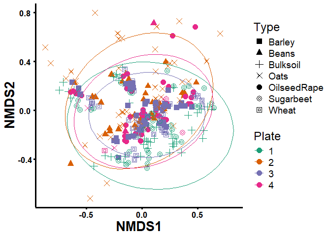
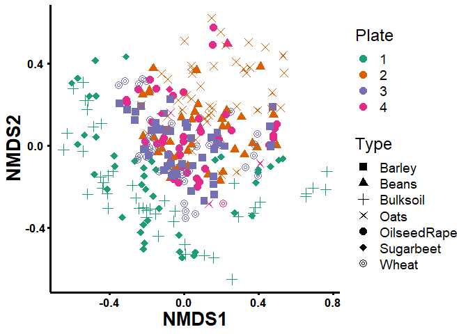

# How-to Guide: Correcting Batch Effects

The UK Crop Microbiome Cryobank integrates genomic (DNA) data with a cryobank collection of samples for the soil microbiomes of the UK major crop plant systems. For this project, the microbiomes are from the rhizosphere (the soil surrounding the crop plant roots) and from bulk soil (soil outside the rhizosphere). The Cryobank provides a facility for researchers to source data and samples, including cryo-preserved microbial material and genomic and metagenomic sequences from different soil microbiome environments.

### Convert Qiime2 objects to Phyloseq objects

`Qiime2` is a microbial community analysis tool used for sequencing
analysis, while `Phyloseq` is an R package for analyzing high-throughput
sequencing data. The `Qiime2R` package allows conversion of `Qiime2`
data to `Phyloseq` within R. R enhances features through external
packages from sources like CRAN, Bioconductor, and GitHub. After
installation, packages must be loaded into the R session using the
**library()** function.Once data is imported, Phyloseq enables data
manipulation, analysis, and visualization. This conversion leverages R’s
analysis tools like ggplot2 for visualization, dplyr for data
manipulation, and vegan for ecological community analysis.

    # Download qiime2R from Github
    # if (!requireNamespace("devtools", quietly = TRUE)){install.packages("devtools")}
    # devtools::install_github("jbisanz/qiime2R")
    library("qiime2R")

    # Download phyloseq from Bioconductor
    # if (!require("BiocManager", quietly = TRUE))
    #   install.packages("BiocManager")
    # BiocManager::install("phyloseq")
    library("phyloseq")

    # install.packages("RColorBrewer")
    library("RColorBrewer")

    # Convert qiime2 results to phyloseq format
    physeq <- qza_to_phyloseq(
      features = "~/005A_SRUC_B/01_UK_CryoBank/GitHub/agmicrobiomebase-main/amplicon-sequence-analysis/amplicon-16S/[Qiime2]Silva_138/428_228_220_table_silva138-with-phyla-no-mitochondria-no-chloroplast.qza", # table.qza
      taxonomy = "~/005A_SRUC_B/01_UK_CryoBank/GitHub/agmicrobiomebase-main/amplicon-sequence-analysis/amplicon-16S/[Qiime2]Silva_138/428_228_220_taxonomy_silva138.qza",
      metadata = "16s_meta-table.txt"
      #, tree = "rooted-tree.qza"
    )

    physeq ## confirm the object

    ## phyloseq-class experiment-level object
    ## otu_table()   OTU Table:         [ 266974 taxa and 332 samples ]
    ## sample_data() Sample Data:       [ 332 samples by 17 sample variables ]
    ## tax_table()   Taxonomy Table:    [ 266974 taxa by 7 taxonomic ranks ]

### Remove unwanted (failed and controls) samples before the normalisation

Removing unwanted samples before normalisation is a common step in
microbiome data analysis pipelines. In many cases, some samples may fail
during sequencing or quality control, while others may be controls or
blanks that are not of interest. These samples can introduce noise and
bias in downstream analyses if not removed. By removing the unwanted
samples before normalization, the remaining samples can be normalised
based on their true biological variation, allowing for more accurate
comparisons between samples.

    # sample_names(physeq) 
    # rank_names(physeq) # "Kingdom" "Phylum" "Class" "Order" "Family" "Genus" "Species"

    ## unwanted samples removel (including failed samples)
    physeq.ori <- subset_samples(physeq, Analysis == "Include")

    ## remove object
    rm(physeq)

### Batch effects correction using Constrained Quantile Normalisation (ConQUR)

Constrained Quantile Normalisation (ConQUR,
<https://www.nature.com/articles/s41467-022-33071-9>) is a normalisation
technique used in high-throughput sequencing data, particularly in
microbiome studies. It is a type of **quantile normalisation** approach
that preserves the relative abundances of taxa between samples while
simultaneously removing systematic technical variations that can arise
due to differences in sequencing depth, PCR amplification bias, or other
factors. ConQUR uses kernel density estimation to model the distribution
of taxon abundances across all samples, and then constrains the
normalisation process to maintain the relative position of each taxon
within that distribution.

    # devtools::install_github("wdl2459/ConQuR")
    library(ConQuR)

    # Download phyloseq from CRAN
    # install.packages("doParallel")
    library(doParallel)

    # Convert ASV table to a data frame and transpose
    B <- as.data.frame(physeq.ori@otu_table) # taxa
    B <- t(B)
    B <- as.data.frame(B) 

    # Extract batch ID from sample data
    batchid = physeq.ori@sam_data$Plate # batchid

    # Extract covariates
    D = physeq.ori@sam_data[, c('Type', 'Soil', 'Location')] #covar
    summary(D)

    ##           Type    Soil     Location
    ##  Barley     :44   CL: 68   AN:35   
    ##  Beans      :44   CY: 69   BE:33   
    ##  Bulksoil   :45   SC: 70   BO:35   
    ##  Oats       :45   SL:101   BU:35   
    ##  OilseedRape:41            HE:35   
    ##  Sugarbeet  :45            SH:68   
    ##  Wheat      :44            YO:67

    # Correct for batch effects using ConQuR package
    options(warn=-1) # required to call
    taxa_correct1 = ConQuR(tax_tab = B, 
                           batchid = batchid, 
                           covariates = D, 
                           batch_ref="1"
                           ) #  warning messages may appear & it can be ignored

    # Transpose the corrected matrix and convert it to a data frame
    taxa_correct2 <- t(taxa_correct1)
    taxa_correct2 <- as.data.frame(taxa_correct2)

    # Create new ASV table, taxonomy table, and sample data
    ASV = otu_table(taxa_correct2, taxa_are_rows = TRUE)
    TAXA = tax_table(physeq.ori)
    sampledata = sample_data(physeq.ori)

    # repack the objects into a level 4 phyloseq structural data
    physeq.norm = phyloseq(ASV, TAXA, sampledata)

    # remove
    rm(B, D, batchid, taxa_correct1, taxa_correct2, ASV, TAXA, sampledata, to_skip)

### Bata diversity - before and after the normalisation

Beta diversity quantifies variation in microbial composition among
samples, aiding in identifying patterns in microbial distribution.
Non-Metric Multidimensional Scaling (NMDS) and Principal Coordinates
Analysis (PCoA) are ordination techniques used for beta diversity
analysis.

**NMDS** preserves the rank order of pairwise dissimilarities between
samples in a lower-dimensional space, making it suitable for cases where
distances between samples are not well-preserved. The distances on the
NMDS plot reflect the similarities or dissimilarities between samples
but are not directly interpretable.

**PCoA**, a metric multidimensional scaling technique, attempts to
preserve the actual distances between samples in a lower-dimensional
space. The distances on the PCoA plot reflect the actual dissimilarities
between samples. Unlike NMDS, PCoA may not perform as well with
non-linear or rank-based dissimilarity measures.

Here, we employ NMDS to analyze Beta diversity, allowing us to draw
comparisons between the states before and after normalisation.

    # install.packages("ggplot2")
    library("ggplot2")
    # install.packages("dplyr")
    library("dplyr")
    # install.packages("ggpubr")
    library("ggpubr")

### Bata diversity - before the normalisation

    # method options: NMDS / PCoA

    NMDS1 <- ordinate(physeq = physeq.ori, 
                      method = "NMDS", 
                      distance = "bray"
                      )

    ## Square root transformation
    ## Wisconsin double standardization
    ## Run 0 stress 0.1860312 
    ## Run 1 stress 0.1924342 
    ## Run 2 stress 0.186164 
    ## ... Procrustes: rmse 0.01372099  max resid 0.2230774 
    ## Run 3 stress 0.1883164 
    ## Run 4 stress 0.1863962 
    ## ... Procrustes: rmse 0.01654292  max resid 0.2231701 
    ## Run 5 stress 0.2246623 
    ## Run 6 stress 0.1976912 
    ## Run 7 stress 0.2314015 
    ## Run 8 stress 0.1895221 
    ## Run 9 stress 0.2114755 
    ## Run 10 stress 0.1910981 
    ## Run 11 stress 0.1904803 
    ## Run 12 stress 0.1900839 
    ## Run 13 stress 0.1976688 
    ## Run 14 stress 0.1955861 
    ## Run 15 stress 0.1936987 
    ## Run 16 stress 0.1927283 
    ## Run 17 stress 0.1955449 
    ## Run 18 stress 0.2114023 
    ## Run 19 stress 0.1978214 
    ## Run 20 stress 0.1877863 
    ## *** Best solution was not repeated -- monoMDS stopping criteria:
    ##      2: no. of iterations >= maxit
    ##     13: stress ratio > sratmax
    ##      5: scale factor of the gradient < sfgrmin

    # Plot ordination
    plot_ordination(physeq = physeq.ori,
                          ordination = NMDS1,
                          color = "Plate",
                          shape = "Type"
                          ) + 
      theme_classic() + 
      geom_point(aes(color = Plate), alpha = 1, size = 3.5) +
      theme(
        text = element_text(size = 18, colour = "black"), 
        axis.ticks = element_line(colour = "black", size = 1.1),
        axis.line = element_line(colour = 'black', size = 1.1),
        axis.text.x = element_text(colour = "black", angle = 0, hjust = 0.5, 
                                   size = 13, face = "bold"),
        axis.text.y = element_text(colour = "black", angle = 0, hjust = 0.5, 
                                   size = 13, face = "bold"),
        axis.title.y = element_text(color = "black", size = 20, face = "bold"), 
        axis.title.x = element_text(color = "black", size = 20, face = "bold")) + 
      scale_color_brewer(palette = "Dark2") + 
      scale_fill_brewer(palette = "Dark2") + 
      scale_shape_manual(values = c(15, 17, 3, 4, 16, 18, 21, 22, 23)) # Set custom shapes

### Bata diversity - after the normalisation

    ##### based on Plate and Type - after the normalisation
    # method options: NMDS / PCoA
    NMDS2 <- ordinate(physeq = physeq.norm, 
                      method = "NMDS", 
                      distance = "bray"
                      )

    ## Square root transformation
    ## Wisconsin double standardization
    ## Run 0 stress 0.2013146 
    ## Run 1 stress 0.2049347 
    ## Run 2 stress 0.198895 
    ## ... New best solution
    ## ... Procrustes: rmse 0.01199222  max resid 0.07625173 
    ## Run 3 stress 0.2037871 
    ## Run 4 stress 0.1984918 
    ## ... New best solution
    ## ... Procrustes: rmse 0.006558361  max resid 0.07675562 
    ## Run 5 stress 0.1986568 
    ## ... Procrustes: rmse 0.004255006  max resid 0.05756308 
    ## Run 6 stress 0.1984916 
    ## ... New best solution
    ## ... Procrustes: rmse 0.0002363932  max resid 0.00262791 
    ## ... Similar to previous best
    ## Run 7 stress 0.2001796 
    ## Run 8 stress 0.216017 
    ## Run 9 stress 0.2099442 
    ## Run 10 stress 0.1986449 
    ## ... Procrustes: rmse 0.003391709  max resid 0.05792202 
    ## Run 11 stress 0.222467 
    ## Run 12 stress 0.2307182 
    ## Run 13 stress 0.2013148 
    ## Run 14 stress 0.1986568 
    ## ... Procrustes: rmse 0.004232279  max resid 0.05763086 
    ## Run 15 stress 0.2329058 
    ## Run 16 stress 0.2113863 
    ## Run 17 stress 0.2139962 
    ## Run 18 stress 0.1985111 
    ## ... Procrustes: rmse 0.0009544431  max resid 0.0157365 
    ## Run 19 stress 0.203646 
    ## Run 20 stress 0.1996238 
    ## *** Best solution repeated 1 times

    # Plot ordination
    plot_ordination(physeq = physeq.norm,
                    ordination = NMDS2,
                    color = "Plate",
                    shape = "Type"
                    ) +
      theme_classic() + 
      geom_point(aes(color = Plate), alpha = 1, size = 3.5) +
      theme(
        text = element_text(size = 18, colour = "black"), 
        axis.ticks = element_line(colour = "black", size = 1.1),
        axis.line = element_line(colour = 'black', size = 1.1),
        axis.text.x = element_text(colour = "black", angle = 0, hjust = 0.5, 
                                   size = 13, face = "bold"),
        axis.text.y = element_text(colour = "black", angle = 0, hjust = 0.5, 
                                   size = 13, face = "bold"),
        axis.title.y = element_text(color = "black", size = 20, face = "bold"), 
        axis.title.x = element_text(color = "black", size = 20, face = "bold")
      ) + 
      scale_color_brewer(palette = "Dark2") + 
      scale_fill_brewer(palette = "Dark2") + 
      scale_shape_manual(values = c(15, 17, 3, 4, 16, 18, 21, 22, 23)) # Set custom shapes

#### Convert `physeq.norm` object to ASV matrix and Save the “physeq.norm” object for the other case study analysis

### Session Info

    sessionInfo()

    ## R version 4.3.2 (2023-10-31 ucrt)
    ## Platform: x86_64-w64-mingw32/x64 (64-bit)
    ## Running under: Windows 10 x64 (build 19045)
    ## 
    ## Matrix products: default
    ## 
    ## 
    ## locale:
    ## [1] LC_COLLATE=English_United Kingdom.utf8 
    ## [2] LC_CTYPE=English_United Kingdom.utf8   
    ## [3] LC_MONETARY=English_United Kingdom.utf8
    ## [4] LC_NUMERIC=C                           
    ## [5] LC_TIME=English_United Kingdom.utf8    
    ## 
    ## time zone: Europe/London
    ## tzcode source: internal
    ## 
    ## attached base packages:
    ## [1] parallel  stats     graphics  grDevices utils     datasets  methods  
    ## [8] base     
    ## 
    ## other attached packages:
    ##  [1] ggpubr_0.6.0       dplyr_1.1.2        ggplot2_3.4.2      doParallel_1.0.17 
    ##  [5] iterators_1.0.14   foreach_1.5.2      ConQuR_2.0         RColorBrewer_1.1-3
    ##  [9] phyloseq_1.44.0    qiime2R_0.99.6    
    ## 
    ## loaded via a namespace (and not attached):
    ##   [1] tensorA_0.36.2.1        rstudioapi_0.15.0       jsonlite_1.8.7         
    ##   [4] shape_1.4.6             magrittr_2.0.3          NADA_1.6-1.1           
    ##   [7] farver_2.1.1            rmarkdown_2.25          zlibbioc_1.46.0        
    ##  [10] vctrs_0.6.3             multtest_2.56.0         ROCR_1.0-11            
    ##  [13] RCurl_1.98-1.12         base64enc_0.1-3         rstatix_0.7.2          
    ##  [16] htmltools_0.5.7         broom_1.0.5             truncnorm_1.0-9        
    ##  [19] Rhdf5lib_1.22.0         Formula_1.2-5           rhdf5_2.44.0           
    ##  [22] KernSmooth_2.23-22      htmlwidgets_1.6.4       plyr_1.8.8             
    ##  [25] igraph_1.5.1            lifecycle_1.0.4         pkgconfig_2.0.3        
    ##  [28] Matrix_1.6-0            R6_2.5.1                fastmap_1.1.1          
    ##  [31] GenomeInfoDbData_1.2.10 clue_0.3-65             digest_0.6.33          
    ##  [34] colorspace_2.1-0        spatial_7.3-17          S4Vectors_0.38.1       
    ##  [37] Hmisc_5.1-1             vegan_2.6-4             labeling_0.4.3         
    ##  [40] randomForest_4.7-1.1    fansi_1.0.4             abind_1.4-5            
    ##  [43] mgcv_1.9-0              compiler_4.3.2          withr_3.0.0            
    ##  [46] htmlTable_2.4.2         backports_1.4.1         inline_0.3.19          
    ##  [49] carData_3.0-5           fastDummies_1.7.3       highr_0.10             
    ##  [52] gplots_3.1.3.1          ggsignif_0.6.4          MASS_7.3-60            
    ##  [55] bayesm_3.1-6            quantreg_5.97           biomformat_1.28.0      
    ##  [58] fBasics_4032.96         gtools_3.9.5            caTools_1.18.2         
    ##  [61] permute_0.9-7           tools_4.3.2             foreign_0.8-85         
    ##  [64] ape_5.7-1               nnet_7.3-19             glue_1.6.2             
    ##  [67] stabledist_0.7-1        nlme_3.1-163            rhdf5filters_1.12.1    
    ##  [70] grid_4.3.2              checkmate_2.3.1         cluster_2.1.4          
    ##  [73] reshape2_1.4.4          ade4_1.7-22             generics_0.1.3         
    ##  [76] gtable_0.3.4            tidyr_1.3.1             data.table_1.14.8      
    ##  [79] car_3.1-2               utf8_1.2.3              XVector_0.40.0         
    ##  [82] rmutil_1.1.10           BiocGenerics_0.46.0     ggrepel_0.9.5          
    ##  [85] pillar_1.9.0            stringr_1.5.1           robustbase_0.99-2      
    ##  [88] splines_4.3.2           lattice_0.21-9          survival_3.5-7         
    ##  [91] GUniFrac_1.8            SparseM_1.81            compositions_2.0-8     
    ##  [94] tidyselect_1.2.0        Biostrings_2.68.1       knitr_1.45             
    ##  [97] gridExtra_2.3           IRanges_2.34.1          zCompositions_1.5.0-1  
    ## [100] stats4_4.3.2            xfun_0.42               Biobase_2.60.0         
    ## [103] statmod_1.5.0           timeDate_4032.109       matrixStats_1.2.0      
    ## [106] DEoptimR_1.1-3          DT_0.31                 stringi_1.7.12         
    ## [109] yaml_2.3.8              evaluate_0.23           codetools_0.2-19       
    ## [112] timeSeries_4032.109     cqrReg_1.2.1            tibble_3.2.1           
    ## [115] cli_3.6.1               rpart_4.1.21            munsell_0.5.0          
    ## [118] Rcpp_1.0.11             GenomeInfoDb_1.36.4     stable_1.1.6           
    ## [121] modeest_2.4.0           MatrixModels_0.5-3      bitops_1.0-7           
    ## [124] glmnet_4.1-8            scales_1.3.0            statip_0.2.3           
    ## [127] purrr_1.0.2             crayon_1.5.2            rlang_1.1.1
