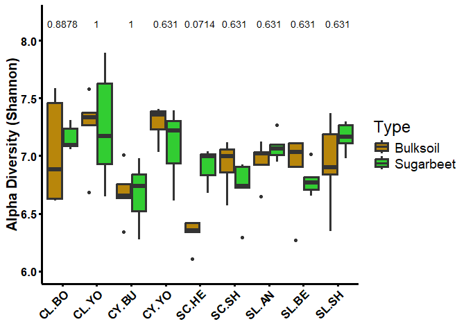

# The influence of soil type (Sugarbeet vs Bulksoil)
## Author : Payton Yau
## Date : 02-04-2024

Sugar beet, a member of the Brassica family, is cultivated in the United
Kingdom and other regions for its tuber, which is rich in sucrose. In
our study, we specifically examined this single crop type to understand
the impact of soil type and locale. Our investigation focused on the
rhizosphere effect, which involves the selection of specific soil
microbiota members. To do this, we compared the diversity of the sugar
beet rhizosphere with that of a no-plant control of bulk soil.

### Load the previously saved data

    load("norm.RData") # load physeq.norm

The "norm.RData" object contains the normalised data for the analyses which is from the case study 00 - preparation and the file can be found from https://github.com/paytonyau/agmicrobiomebase/tree/main/publications-scripts/How-to-paper/case_00_02_RData

### Load the tidyverse and reshape2 libraries

    # install.packages("tidyverse")
    library("tidyverse") # tidyverse includes several packages for data manipulation and visualisation
    library("reshape2") # reshape2 is for data reshaping
    library("phyloseq")

### Extract Sugarbeet and Bulk Soil groups

    ## (1) Sub-samples for Sugarbeet and Bulk Soil groups for the comparisons
    physeq.SU <- physeq.norm %>% subset_samples(Type %in% c("Sugarbeet", "Bulksoil"))

    ## (2) Subset the samples in the phyloseq object that belong to "Sugarbeet" 
    ## or other crops "Barley", "Beans", "Bulksoil", "Oats", "OilseedRape", "Sugarbeet"
    physeq.Sugarbeet <- subset_samples(physeq.norm, Type=="Sugarbeet")

    ## (3A) Merge the replicate samples for each Group
    physeq.Sugarbeet.group = merge_samples(physeq.Sugarbeet, "Group") # Sum between replicate samples

    # (3B) repair factors in the sample metadata
    # sample_data(physeq.Sugarbeet.group)$Group <- levels(sample_data(physeq.norm)$Group)[get_variable(physeq.Sugarbeet.group, "Group")]
     # or another option
    sample_data(physeq.Sugarbeet.group)$Group <- rownames(sample_data(physeq.Sugarbeet.group))
    sample_data(physeq.Sugarbeet.group)$Soil <- levels(sample_data(physeq.norm)$Soil)[get_variable(physeq.Sugarbeet.group, "Soil")]
    sample_data(physeq.Sugarbeet.group)$Soil.Location <- levels(sample_data(physeq.norm)$Soil.Location)[get_variable(physeq.Sugarbeet.group, "Soil.Location")]

    ## (4) Further subgroup for SU.CL.BO vs SU.CL.YO
    physeq.Sugarbeet.vs <- physeq.Sugarbeet %>% subset_samples(Group %in% c("SU.CL.BO", "SU.CL.YO"))

## Bata diversity - before and after the normalisation

Beta diversity quantifies variation in microbial composition among
samples, aiding in identifying patterns in microbial distribution.
Non-Metric Multidimensional Scaling (NMDS) and Principal Coordinates
Analysis (PCoA) are ordination techniques used for beta diversity
analysis.

**NMDS** preserves the rank order of pairwise dissimilarities between
samples in a lower-dimensional space, making it suitable for cases where
distances between samples are not well-preserved. The distances on the
NMDS plot reflect the similarities or dissimilarities between samples
but are not directly interpretable.

PCoA, a metric multidimensional scaling technique, attempts to preserve
the actual distances between samples in a lower-dimensional space. The
distances on the PCoA plot reflect the actual dissimilarities between
samples. Unlike NMDS, PCoA may not perform as well with non-linear or
rank-based dissimilarity measures.

Here, we employ NMDS to analyze Beta diversity, allowing us to draw
comparisons between the states before and after normalisation.

    # install.packages("ggplot2")
    library("ggplot2")
    # install.packages("dplyr")
    library("dplyr")
    # install.packages("ggpubr")
    library("ggpubr")

we examine sugarbeet and bulk soil

    # method options: c("DCA", "CCA", "RDA", "CAP", "DPCoA", "NMDS", "MDS", "PCoA")
    NMDS <- ordinate(physeq = physeq.SU, 
                     method = "NMDS", 
                     distance = "bray"
                     )

    ## Square root transformation
    ## Wisconsin double standardization
    ## Run 0 stress 0.1677248 
    ## Run 1 stress 0.1703061 
    ## Run 2 stress 0.1682565 
    ## Run 3 stress 0.1682565 
    ## Run 4 stress 0.1771023 
    ## Run 5 stress 0.1730918 
    ## Run 6 stress 0.1786589 
    ## Run 7 stress 0.1803442 
    ## Run 8 stress 0.1978968 
    ## Run 9 stress 0.1826739 
    ## Run 10 stress 0.1737444 
    ## Run 11 stress 0.170305 
    ## Run 12 stress 0.1673053 
    ## ... New best solution
    ## ... Procrustes: rmse 0.01794214  max resid 0.1542882 
    ## Run 13 stress 0.1789487 
    ## Run 14 stress 0.1664906 
    ## ... New best solution
    ## ... Procrustes: rmse 0.04198343  max resid 0.1826602 
    ## Run 15 stress 0.1694795 
    ## Run 16 stress 0.1673053 
    ## Run 17 stress 0.1681805 
    ## Run 18 stress 0.1675557 
    ## Run 19 stress 0.1771023 
    ## Run 20 stress 0.168264 
    ## *** Best solution was not repeated -- monoMDS stopping criteria:
    ##     17: stress ratio > sratmax
    ##      3: scale factor of the gradient < sfgrmin

    groups_to_ellipse <- c("SC.HE", "CY.BU") # Replace with your actual group names

    physeq.SU.subset <- subset_samples(physeq.SU, Soil.Location %in% groups_to_ellipse)

    # Convert physeq.SU.subset to a data frame
    df <- sample_data(physeq.SU.subset)

    my_palette <- c("darkgoldenrod", "limegreen")

    # Create the ordination plot
    plot_ordination <- plot_ordination(physeq = physeq.SU, 
                                       ordination = NMDS, 
                                       color = "Type", 
                                       shape = "Soil.Location")

    # Extract ordination scores from the plot
    df <- plot_ordination$data

    # Subset the data for the groups to ellipse
    df_subset <- df[df$Soil.Location %in% groups_to_ellipse, ]

    # Add the ellipse for the subsetted data

    plot_ordination <- plot_ordination + 
      stat_ellipse(data = df_subset, 
                   type="norm", 
                   alpha=0.25, 
                   aes(group = Soil.Location), 
                   linetype = 1, 
                   size = 0.8, 
                   colour = "purple4"
                   ) +
      theme_classic() + 
      geom_point(aes(color = Type), alpha = 1, size = 3.5) +
      theme(
        text = element_text(size = 18, colour = "black"), 
        axis.ticks = element_line(colour = "black", size = 1.1),
        axis.line = element_line(colour = 'black', size = 1.1),
        axis.text.x = element_text(colour = "black", angle = 0, hjust = 0.5, 
                                   size = 13, face = "bold"),
        axis.text.y = element_text(colour = "black", angle = 0, hjust = 0.5, 
                                   size = 13, face = "bold"),
        axis.title.y = element_text(color = "black", size = 20, face = "bold"), 
        axis.title.x = element_text(color = "black", size = 20, face = "bold")) +
      scale_color_manual(values = my_palette) +
      scale_fill_manual(values = my_palette) +
      scale_shape_manual(values = c(15, 17, 3, 4, 16, 18, 21, 22, 23)) # Set custom shapes

    # Plot ordination
    # pdf(file = "bata_SU.pdf", width = 9,height = 6)
    plot_ordination

    # Close the PDF device and save the plot to a file
    # dev.off()
      
    # Clean up by removing objects that are no longer needed
    # rm(NMDS, physeq.SU)

#### Alpha diversity

Alpha diversity refers to the diversity of species within a single
ecosystem or habitat. It is measured by analysing the number and
distribution of species within a specific area or sample. Alpha
diversity indices take into account the richness (number of species) and
evenness (relative abundance of species) of a community. It provides
insights into the complexity and stability of ecosystems. A high level
of alpha diversity indicates a more complex ecosystem with a greater
number of species, which is often associated with greater ecological
resilience and stability. In contrast, a low level of alpha diversity
can be an indicator of ecosystem disturbance, degradation, or
vulnerability.

Please noted that different types of alpha diversity metrics capture
various aspects of biodiversity within a specific community. Here’s a
brief explanation of each:

-   **Observed**: This metric simply counts the number of unique species
    (or operational taxonomic units) present in a sample. It provides a
    basic measure of species richness.

-   **Chao1**: Chao1 estimates the total number of species by
    considering the number of rare or singleton species. It takes into
    account the number of singletons (species observed only once) and
    doubletons (species observed only twice).

-   **ACE (Abundance-based Coverage Estimator)**: Similar to Chao1, ACE
    also estimates species richness by accounting for rare species, but
    it also considers their abundance in the community.

-   **Shannon Diversity Index**: This index takes into account both
    species richness and evenness in the community. It considers the
    number of species present as well as their relative abundances.

-   **Simpson Diversity Index**: Simpson’s index gives more weight to
    dominant species in the community. It reflects the probability that
    two randomly selected individuals belong to different species.

-   **Inverse Simpson Diversity Index (InvSimpson)**: This index is the
    reciprocal of the Simpson index and is useful for emphasizing the
    dominance of a few species.

-   **Fisher’s Alpha**: Fisher’s alpha is a measure of species richness
    that takes into account the distribution of individuals among
    species. It’s particularly useful for comparing species diversity
    between different communities.

(<https://docs.cosmosid.com/docs/alpha-diversity>)

Here, we use Shannon as an example for the work

    # available measurements: "Observed" "Chao1" "ACE" "Shannon" "Simpson" "InvSimpson" "Fisher"
    # Calculate alpha diversity (Shannon) and store it in physeq.SU object
    alpha.object <- cbind(
      x = sample_data(physeq.SU),
      y = estimate_richness(physeq.SU, measures = 'Shannon')
    )

    # Data preparation (formatting)
    selected_columns <- alpha.object[, c("x.Soil.Location", "x.Group", "x.Type", "Shannon")]
    selected_columns2 <- melt(selected_columns)
    names(selected_columns2) <- c("Soil_Location","Group" , "Type", "variable", "Shannon")

    # Define the comparisons
    my_comparisons <- list(
      c("SU.CL.BO", "CO.CL.BO"),
      c("SU.CL.YO", "CO.CL.YO"),
      c("SU.CY.BU", "CO.CY.BU"),
      c("SU.CY.YO", "CO.CY.YO"),
      c("SU.SC.HE", "CO.SC.HE"),
      c("SU.SC.SH", "CO.SC.SH"),
      c("SU.SL.AN", "CO.SL.AN"),
      c("SU.SL.BE", "CO.SL.BE"),
      c("SU.SL.SH", "CO.SL.SH")
    )

    # Initialise an empty data frame to store the results
    results <- data.frame()

    # Perform t-tests for each pair of groups
    for (i in seq_along(my_comparisons)) {
      group1_data <- selected_columns2$Shannon[selected_columns2$Group == my_comparisons[[i]][1]]
      group2_data <- selected_columns2$Shannon[selected_columns2$Group == my_comparisons[[i]][2]]
      
      wilcox_test_result <- wilcox.test(group1_data, group2_data)
      
      results <- rbind(results, data.frame(
        group1 = my_comparisons[[i]][1],
        group2 = my_comparisons[[i]][2],
        p.value = wilcox_test_result$p.value
      ))
    }

    # Adjust the p-values for multiple comparisons using the Benjamini-Hochberg procedure
    results$p.adjusted <- p.adjust(results$p.value, method = "BH")

    # Add significance levels based on the adjusted p-values
    results$p.signif <- symnum(results$p.adjusted, corr = FALSE, na = FALSE,
                               cutpoints = c(0, 0.001, 0.01, 0.05, 0.1, 1),
                               symbols = c("***", "**", "*", ".", " "))

    # print result
    print(results)

    ##     group1   group2     p.value p.adjusted p.signif
    ## 1 SU.CL.BO CO.CL.BO 0.690476190 0.88775510         
    ## 2 SU.CL.YO CO.CL.YO 1.000000000 1.00000000         
    ## 3 SU.CY.BU CO.CY.BU 1.000000000 1.00000000         
    ## 4 SU.CY.YO CO.CY.YO 0.309523810 0.63095238         
    ## 5 SU.SC.HE CO.SC.HE 0.007936508 0.07142857        .
    ## 6 SU.SC.SH CO.SC.SH 0.222222222 0.63095238         
    ## 7 SU.SL.AN CO.SL.AN 0.420634921 0.63095238         
    ## 8 SU.SL.BE CO.SL.BE 0.222222222 0.63095238         
    ## 9 SU.SL.SH CO.SL.SH 0.420634921 0.63095238

    # Defind colour
    my_palette <- c("darkgoldenrod", "limegreen")

    # Create the boxplot
    p <- ggplot(data=selected_columns2, aes(x=Soil_Location, y= Shannon, fill = Type)) + 
      geom_boxplot(size = 1.1, 
                   width = 0.825, 
                   color = "grey20", 
                   position = position_dodge(0.9)
      ) +
      scale_fill_manual(values = my_palette) +
      labs(x = element_blank(),                     
           y = "Alpha Diversity (Shannon)"          
      ) + 
      theme_classic() + 
      theme(
        text = element_text(size = 18, colour = "black"), 
        axis.ticks = element_line(colour = "black", size = 1.1),
        axis.line = element_line(colour = 'black', size = 1.1),
        axis.text.x = element_text(colour = "black", angle = 45, hjust = 1, 
                                   size = 13, face = "bold"),
        axis.text.y = element_text(angle = 0, hjust = 0, colour = "black", 
                                   size = 13, face = "bold"),
        axis.title.y = element_text(color = "black", size = 15, face = "bold"),
        legend.position = "right") +
      scale_y_continuous(breaks = seq(6, 8, by = 0.5), limits = c(6, 8.2))  

    # Add the results of the comparisons to the plot
    for (i in seq_len(nrow(results))) {
      
      # Set the y position for the label
      y_position <- 8.15
      
      # Add the label to the plot
    p <- p + annotate("text", x = i, 
                      y=y_position , 
                      label=round(results$p.adjusted[i], 4), 
                      size= 3.75, face = "bold")
    }

    # Create a plot for alpha diversity
    # pdf(file = "Fig7B_alpha.pdf", width = 8,height = 5)

    # Print the plot
    print(p)

    # Close the PDF device and save the plot to a file
    # dev.off()

    # Clean up by removing the alpha.object
    # rm(alpha.object, selected_columns, selected_columns2, my_comparisons, results, my_palette, group1_data, group2_data, t_test_result)

#### Determine the count of taxa within each level and group

The purpose of this process is to visualise the distribution of the
number of matched abundance across different groups and to identify any
patterns in the distribution of the processed abundance within
individual group.

    # Create an empty list to store genus-level abundance data for each taxonomic level
    gentab_levels <- list()

    # Set observation threshold
    observationThreshold <- 1

    # Define the taxonomic levels
    genus_levels <- c("Kingdom", "Phylum", "Class", "Order", 
                      "Family", "Genus", "Species")

    # loop through all the taxonomic levels
    for (level in genus_levels) {
      
      # create a factor variable for each level
      genfac <- factor(tax_table(physeq.Sugarbeet.group)[, level])
      
      # calculate the abundance of each genus within each sample
      gentab <- apply(otu_table(physeq.Sugarbeet.group), MARGIN = 1, function(x) {
        tapply(x, INDEX = genfac, FUN = sum, na.rm = TRUE, simplify = TRUE)
      })
      
      # calculate the number of samples in which each genus is observed above the threshold
      level_counts <- apply(gentab > observationThreshold, 2, sum)
      
      # create a data frame of level counts with genus names as row names
      BB <- as.data.frame(level_counts)
      BB$name <- row.names(BB)
      
      # add the data frame to the gentab_levels list
      gentab_levels[[level]] <- BB
    }

    # Combine all level counts data frames into one data frame
    B2 <- gentab_levels %>% reduce(full_join, by = "name")

    # Set row names and column names
    rownames(B2) <- B2$name
    B2$name <- NULL
    colnames(B2)[1:7] <- genus_levels

    # Print the resulting data frame
    print(B2)

    ##          Kingdom Phylum Class Order Family Genus Species
    ## SU.CL.BO       2     40   120   265    389   593     304
    ## SU.CL.YO       2     44   127   304    441   716     386
    ## SU.CY.BU       2     36   101   235    344   549     277
    ## SU.CY.YO       2     42   121   282    408   626     313
    ## SU.SC.HE       2     38   107   245    361   548     306
    ## SU.SC.SH       2     38   109   234    323   476     220
    ## SU.SL.AN       2     40   120   272    400   598     289
    ## SU.SL.BE       2     41   112   250    356   532     254
    ## SU.SL.SH       2     38   112   254    370   569     300

    # Clean up by removing unnecessary objects
    rm(gentab_levels, BB)

#### Pairwise comparison using PERMANOVA

Pairwise PERMANOVA is a statistical method used to compare multiple
groups or treatments in ecological and microbial community studies. It
assesses dissimilarity between samples and provides a p-value to
determine the significance of observed differences. This approach is
valuable for targeted group comparisons, allowing researchers to
investigate the effects of specific factors on microbial communities and
uncover significant variations in community composition. By considering
within- and between-group variation, pairwise PERMANOVA provides robust
statistical analysis and insights into microbial community dynamics and
functioning.

    # devtools::install_github("pmartinezarbizu/pairwiseAdonis/pairwiseAdonis")
    library("pairwiseAdonis")
    library("GGally")

    metdat = as.data.frame(as.matrix(physeq.SU@sam_data))
    dat = as.data.frame(t(as.data.frame(physeq.SU@otu_table)))

    # Define the pairs for comparison
    pairs <- list(
      c("SU.CL.BO", "CO.CL.BO"),
      c("SU.CL.YO", "CO.CL.YO"),
      c("SU.CY.BU", "CO.CY.BU"),
      c("SU.CY.YO", "CO.CY.YO"),
      c("SU.SC.HE", "CO.SC.HE"),
      c("SU.SC.SH", "CO.SC.SH"),
      c("SU.SL.AN", "CO.SL.AN"),
      c("SU.SL.BE", "CO.SL.BE"),
      c("SU.SL.SH", "CO.SL.SH")
    )

    # Initialize an empty list to store the results
    results <- list()

    # Loop over each pair
    for(i in seq_along(pairs)) {
      pair <- pairs[[i]]
      
      dat$Group = metdat$Group
      dat_subset <- dat[dat$Group %in% pair, ]
      dat_subset$Group <- NULL
      
      metdat_subset <- metdat[metdat$Group %in% pair, ]
      
      # Perform the pairwise comparison
      results[[i]] <- pairwise.adonis(dat_subset, 
                                      metdat_subset$Group, 
                                      sim.function = "vegdist",
                                      sim.method = "bray",
                                      reduce = NULL, perm = 100000)
    }

    # Convert the list of results to a data frame
    results_df <- do.call(rbind, lapply(results, function(x) data.frame(t(unlist(x)))))

    # Add the adjusted p-value
    # "bonferroni", "holm", "hochberg", "hommel", "BH" or "BY" 
    results_df$p.adjusted <- p.adjust(results_df$p.value, method = "BH")

    # Print the dataframe to check the new column
    print(results_df)

    ##                  pairs Df         SumsOfSqs           F.Model                R2
    ## 1 CO.CL.BO vs SU.CL.BO  1  0.19234498806295 0.982889882772245 0.109418004183406
    ## 2 CO.CL.YO vs SU.CL.YO  1 0.213461169617495 0.922512086881703 0.103391520000071
    ## 3 CO.CY.BU vs SU.CY.BU  1 0.179825627125348  1.15125484611348 0.125802948936824
    ## 4 CO.CY.YO vs SU.CY.YO  1  0.21153126052888   1.1109025342993 0.121931118252791
    ## 5 CO.SC.HE vs SU.SC.HE  1 0.907826586326208  10.9195252783035 0.577156409459479
    ## 6 CO.SC.SH vs SU.SC.SH  1 0.270828638514029  1.61501960608062 0.167968415275957
    ## 7 CO.SL.AN vs SU.SL.AN  1 0.222511174445787  1.51768215168303 0.159459217853231
    ## 8 CO.SL.BE vs SU.SL.BE  1 0.289600010447189  1.29444922906478 0.139271214158327
    ## 9 CO.SL.SH vs SU.SL.SH  1 0.292493472968061  1.64486102559631 0.170542739934878
    ##               p.value p.adjusted sig
    ## 1   0.396456035439646 0.44601304    
    ## 2   0.523524764752352 0.52352476    
    ## 3   0.232577674223258 0.29902844    
    ## 4   0.174848251517485 0.26227238    
    ## 5 0.00786992130078699 0.04817952   *
    ## 6   0.016059839401606 0.04817952   .
    ## 7   0.015759842401576 0.04817952   .
    ## 8   0.047229527704723 0.08612914   .
    ## 9  0.0478495215047849 0.08612914   .

    # Clean up by removing unnecessary objects
    # rm(metdat, dat, pairs, i, dat_subset, metdat_subset, results, results_df)

    sessionInfo()

    ## R version 4.3.2 (2023-10-31 ucrt)
    ## Platform: x86_64-w64-mingw32/x64 (64-bit)
    ## Running under: Windows 10 x64 (build 19045)
    ## 
    ## Matrix products: default
    ## 
    ## 
    ## locale:
    ## [1] LC_COLLATE=English_United Kingdom.utf8 
    ## [2] LC_CTYPE=English_United Kingdom.utf8   
    ## [3] LC_MONETARY=English_United Kingdom.utf8
    ## [4] LC_NUMERIC=C                           
    ## [5] LC_TIME=English_United Kingdom.utf8    
    ## 
    ## time zone: Europe/London
    ## tzcode source: internal
    ## 
    ## attached base packages:
    ## [1] stats     graphics  grDevices utils     datasets  methods   base     
    ## 
    ## other attached packages:
    ##  [1] GGally_2.2.1         pairwiseAdonis_0.4.1 cluster_2.1.4       
    ##  [4] vegan_2.6-4          lattice_0.21-9       permute_0.9-7       
    ##  [7] ggpubr_0.6.0         phyloseq_1.44.0      reshape2_1.4.4      
    ## [10] lubridate_1.9.3      forcats_1.0.0        stringr_1.5.1       
    ## [13] dplyr_1.1.2          purrr_1.0.2          readr_2.1.5         
    ## [16] tidyr_1.3.1          tibble_3.2.1         ggplot2_3.5.0       
    ## [19] tidyverse_2.0.0     
    ## 
    ## loaded via a namespace (and not attached):
    ##  [1] ade4_1.7-22             tidyselect_1.2.0        farver_2.1.1           
    ##  [4] Biostrings_2.68.1       bitops_1.0-7            fastmap_1.1.1          
    ##  [7] RCurl_1.98-1.12         digest_0.6.33           timechange_0.3.0       
    ## [10] lifecycle_1.0.4         survival_3.5-7          magrittr_2.0.3         
    ## [13] compiler_4.3.2          rlang_1.1.1             tools_4.3.2            
    ## [16] igraph_1.5.1            utf8_1.2.3              yaml_2.3.8             
    ## [19] data.table_1.14.8       ggsignif_0.6.4          knitr_1.45             
    ## [22] labeling_0.4.3          RColorBrewer_1.1-3      plyr_1.8.8             
    ## [25] abind_1.4-5             withr_3.0.0             BiocGenerics_0.46.0    
    ## [28] grid_4.3.2              stats4_4.3.2            fansi_1.0.4            
    ## [31] multtest_2.56.0         biomformat_1.28.0       colorspace_2.1-0       
    ## [34] Rhdf5lib_1.22.0         scales_1.3.0            iterators_1.0.14       
    ## [37] MASS_7.3-60             cli_3.6.1               rmarkdown_2.25         
    ## [40] crayon_1.5.2            generics_0.1.3          rstudioapi_0.15.0      
    ## [43] tzdb_0.4.0              ape_5.7-1               rhdf5_2.44.0           
    ## [46] zlibbioc_1.46.0         splines_4.3.2           parallel_4.3.2         
    ## [49] XVector_0.40.0          vctrs_0.6.3             Matrix_1.6-0           
    ## [52] carData_3.0-5           jsonlite_1.8.7          car_3.1-2              
    ## [55] IRanges_2.34.1          hms_1.1.3               S4Vectors_0.38.1       
    ## [58] rstatix_0.7.2           foreach_1.5.2           glue_1.6.2             
    ## [61] ggstats_0.5.1           codetools_0.2-19        stringi_1.7.12         
    ## [64] gtable_0.3.4            GenomeInfoDb_1.36.4     munsell_0.5.0          
    ## [67] pillar_1.9.0            htmltools_0.5.7         rhdf5filters_1.12.1    
    ## [70] GenomeInfoDbData_1.2.10 R6_2.5.1                evaluate_0.23          
    ## [73] Biobase_2.60.0          highr_0.10              backports_1.4.1        
    ## [76] broom_1.0.5             Rcpp_1.0.11             nlme_3.1-163           
    ## [79] mgcv_1.9-0              xfun_0.42               pkgconfig_2.0.3
