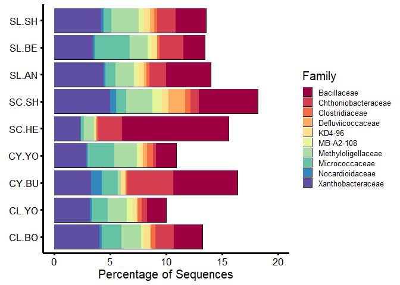
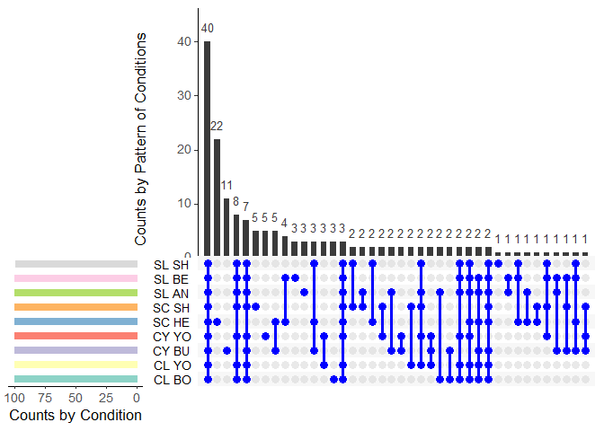
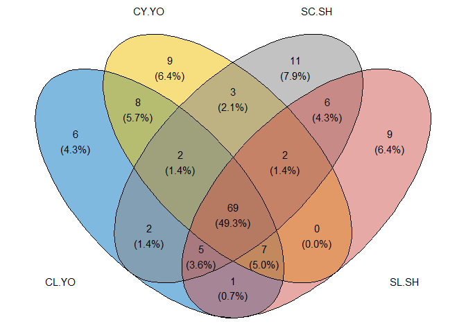

# How-to Guide: Case Study 2 - The Core Microbiome (Sugarbeet vs. Bulk Soil)

To study rhizosphere microbiota, we identified the minimal microbiota
interacting with a specific crop, sugar beet, in natural conditions
across various soils. This approach helps understand real-world
microbial interactions in the rhizosphere.

    library("RColorBrewer")
    library("phyloseq")
    library("ggplot2")

    load("physeq.Sugarbeet.group.RData")

The `physeq.Sugarbeet.group.RData` originally saved from the case study 1. The RData can also be found from 
https://github.com/paytonyau/agmicrobiomebase/tree/main/publications-scripts/How-to-paper/case_00_02_RData

### Plotting the top 10 taxa at family level

Plotting the top 10 taxa at the family level offers a clear and concise
overview of the microbial composition. This method not only highlights
the most prevalent families in the sample but also simplifies complex
microbiome data. It facilitates comparative analysis across different
sample groups and allows for easy interpretation of trends and patterns.
This approach enables quick identification of the most prevalent
families within the corresponding sample groups.

    ## Transform normalised ASVs to proportions 
    proportions = transform_sample_counts(physeq.Sugarbeet.group, function(x) 100 * x/sum(x))

    ##  
    Top10ASVs = names(sort(taxa_sums(proportions), TRUE)[1:21])
    Taxtab10 = cbind(tax_table(proportions), Family10 = NA)
    Taxtab10[Top10ASVs, "Family10"] <- as(tax_table(proportions)[Top10ASVs, "Family"], "character")
    tax_table(proportions) <- tax_table(Taxtab10)

    Rgsm10 = prune_taxa(Top10ASVs, proportions)

    my_palette <- brewer.pal(n = 10, name = "Spectral")  

    # plotting

    p <- plot_bar(Rgsm10, "Soil.Location", fill = "Family") + coord_flip() +  
      ylab("Percentage of Sequences") + ylim(0, 20) + 
      geom_col() +  coord_flip() + 
      scale_fill_manual(values = my_palette) +
      labs(x = element_blank()) + 
      theme_classic() +   
      theme(text = element_text(size=15, colour = "black"), 
            axis.ticks = element_line(colour = "black", size = 1.25),
            axis.line = element_line(colour = 'black', size = 1.25),
            axis.text.x = element_text(angle=0, hjust=0.5, colour = "black", size = 13),
            axis.text.y = element_text(angle=0, hjust=0.5, colour = "black",size = 13),
            axis.title.y = element_text(color="black", size=15,face="bold"), 
            legend.position = "right", 
            legend.text = element_text(size = 9.5), 
            legend.key.height= unit(0.45, 'cm'),
            legend.key.width= unit(0.45, 'cm')
            )

    # Create a plot for alpha diversity
    # pdf(file = "Fig08A_TOP10.pdf", width = 8,height = 5)
    print(p)

    # Close the PDF device and save the plot to a file
    # dev.off()

    # Clean up by removing unnecessary objects
    # rm(proportions, Top10ASVs, Taxtab10, Rgsm10, title)

### Upset plot using UpsetR

When it comes to representing sets visually, the go-to option is usually
a Venn diagram. These diagrams work well when dealing with up to five
sets, providing a clear visualisation. However, as the dataset expands,
such as when dealing with five sets, deriving the desired insights from
the diagram becomes more complex. As a result, considering an UpSet
graph for data visualisation becomes an appealing choice. UpSet graphs
offer a more streamlined way to display intersections and complements,
particularly when dealing with larger datasets or multiple sets. This
option ensures a more intuitive and informative representation of the
data.

    # BiocManager::install("microbiome")
    library("microbiome")

    # devtools::install_github("mikemc/speedyseq")
    library("speedyseq")

    # install.packages("UpSetR")
    library("UpSetR")
    # install.packages("plyr")
    library("plyr")
    # install.packages("reshape2")
    library("reshape2")
    # install.packages("RColorBrewer")
    library("RColorBrewer")
    # install.packages("dplyr")
    library("dplyr")

    # Aggregate taxa at the genus level
    B <- aggregate_taxa(physeq.Sugarbeet.group, "Genus", verbose = TRUE)

    ## [1] "Remove taxonomic information below the target level"
    ## [1] "Mark the potentially ambiguous taxa"
    ## [1] "-- split"
    ## [1] "-- sum"
    ## [1] "Create phyloseq object"
    ## [1] "Remove ambiguous levels"
    ## [1] "-- unique"
    ## [1] "-- Rename the lowest level"
    ## [1] "-- rownames"
    ## [1] "-- taxa"
    ## [1] "Convert to taxonomy table"
    ## [1] "Combine OTU and Taxon matrix into Phyloseq object"
    ## [1] "Add the metadata as is"

    # Remove undesired genera
    B2 <- subset_taxa(B, !get("Genus") %in% c("uncultured", "Unknown"))

    # Remove unwanted taxon names
    taxa_to_remove <- c("uncultured", "Unknown")
    B2 <- subset_taxa(B, !get("Genus") %in% taxa_to_remove)

    # Convert to tibble, rename columns, select relevant columns, group by Sample, and keep top 100 abundant ASVs
    # Convert data to a tibble and perform necessary operations
    D <- as_tibble(B2) %>%
      mutate(Sample = Soil.Location, ASV = .otu, Abundance = .abundance) %>%
      select(Sample, Abundance, Genus) %>%
      group_by(Sample) %>%
      filter(rank(desc(Abundance)) <= 100) %>% # Filter <= 100
      ungroup()

    # Remove the Abundance column
    D$Abundance <- NULL

    # Rename the second column to "ASV"
    names(D)[2] <- "ASV"
    names(D)[1] <- "Soil.Location"

    # Convert data from long to wide format
    E <- dcast(D, ASV ~ Soil.Location)

    # Define a binary function
    binary_fun <- function(x) {
      x[is.na(x)] <- 0
      ifelse(x > 0, 1, 0)
    }

    col = brewer.pal(n = 9, name = "Set3")

    # Apply the binary function to columns 2 to 10
    temp_df <- apply(E[2:10], 2, binary_fun)
    temp_df <- as.data.frame(temp_df)
    rownames(temp_df) = E$ASV

    # Create an UpSet plot
    upset_plot <- upset(temp_df, 
                        sets = colnames(temp_df), 
                        sets.bar.color = (col),
                        order.by = "freq", 
                        empty.intersections = "on",
                        mainbar.y.label = "Counts by Pattern of Conditions", 
                        sets.x.label = "Counts by Condition",
                        matrix.color="blue", 
                        mb.ratio = c(0.6, 0.4),
                        point.size= 2.75,
                        line.size = 1.25, 
                        text.scale = 1.5
    )

    # Create a plot for alpha diversity
    # Open a new PDF graphics device
    # pdf(file = "Fig08B_UpSet.pdf", width=8,height=5)
    # Print the ggtree plot
    print(upset_plot)

    # Close the PDF device and save the plot to a file
    # dev.off()

    # Clean up by removing unnecessary objects
    rm(B, B2, D, E, binary_fun, upset_plot, physeq.Sugarbeet.group, upset_plot)

    # if (!require(devtools)) install.packages("devtools")
    # devtools::install_github("yanlinlin82/ggvenn")

    library(ggvenn)

    # Extract the rows where the value is 1 for each column
    CL.YO <- rownames(temp_df)[temp_df$CL.YO == 1]
    CY.YO <- rownames(temp_df)[temp_df$CY.YO == 1]
    SC.SH <- rownames(temp_df)[temp_df$SC.SH == 1]
    SL.SH <- rownames(temp_df)[temp_df$SL.SH == 1]

    # Create a list with the extracted data
    list_data <- list("CL.YO" = CL.YO, "CY.YO" = CY.YO, "SC.SH" = SC.SH, "SL.SH" = SL.SH)

    # Use ggvenn to create the Venn diagram
    Venn <- ggvenn(
      list_data, 
      fill_color = c("#0073C2FF", "#EFC000FF", "#868686FF", "#CD534CFF"),
      stroke_size = 0.5, set_name_size = 4
      )

    # Open a new PDF graphics device
    # pdf(file = "Fig08C_Venn.pdf", width=5,height=5)

    # Print the Venn plot
    print(Venn)

    # Close the PDF device and save the plot to a file
    # dev.off()

    sessionInfo()

    ## R version 4.3.2 (2023-10-31 ucrt)
    ## Platform: x86_64-w64-mingw32/x64 (64-bit)
    ## Running under: Windows 10 x64 (build 19045)
    ## 
    ## Matrix products: default
    ## 
    ## 
    ## locale:
    ## [1] LC_COLLATE=English_United Kingdom.utf8 
    ## [2] LC_CTYPE=English_United Kingdom.utf8   
    ## [3] LC_MONETARY=English_United Kingdom.utf8
    ## [4] LC_NUMERIC=C                           
    ## [5] LC_TIME=English_United Kingdom.utf8    
    ## 
    ## time zone: Europe/London
    ## tzcode source: internal
    ## 
    ## attached base packages:
    ## [1] grid      stats     graphics  grDevices utils     datasets  methods  
    ## [8] base     
    ## 
    ## other attached packages:
    ##  [1] ggvenn_0.1.10        dplyr_1.1.2          reshape2_1.4.4      
    ##  [4] plyr_1.8.8           UpSetR_1.4.0         speedyseq_0.5.3.9018
    ##  [7] microbiome_1.22.0    ggplot2_3.4.2        phyloseq_1.44.0     
    ## [10] RColorBrewer_1.1-3  
    ## 
    ## loaded via a namespace (and not attached):
    ##  [1] ade4_1.7-22             tidyselect_1.2.0        farver_2.1.1           
    ##  [4] Biostrings_2.68.1       bitops_1.0-7            fastmap_1.1.1          
    ##  [7] RCurl_1.98-1.12         digest_0.6.33           lifecycle_1.0.4        
    ## [10] cluster_2.1.4           survival_3.5-7          magrittr_2.0.3         
    ## [13] compiler_4.3.2          rlang_1.1.1             tools_4.3.2            
    ## [16] igraph_1.5.1            utf8_1.2.3              yaml_2.3.8             
    ## [19] data.table_1.14.8       knitr_1.45              labeling_0.4.3         
    ## [22] Rtsne_0.17              withr_3.0.0             purrr_1.0.2            
    ## [25] BiocGenerics_0.46.0     stats4_4.3.2            fansi_1.0.4            
    ## [28] multtest_2.56.0         biomformat_1.28.0       colorspace_2.1-0       
    ## [31] Rhdf5lib_1.22.0         scales_1.3.0            iterators_1.0.14       
    ## [34] MASS_7.3-60             cli_3.6.1               rmarkdown_2.25         
    ## [37] vegan_2.6-4             crayon_1.5.2            generics_0.1.3         
    ## [40] rstudioapi_0.15.0       ape_5.7-1               rhdf5_2.44.0           
    ## [43] stringr_1.5.1           zlibbioc_1.46.0         splines_4.3.2          
    ## [46] parallel_4.3.2          XVector_0.40.0          vctrs_0.6.3            
    ## [49] Matrix_1.6-0            jsonlite_1.8.7          IRanges_2.34.1         
    ## [52] S4Vectors_0.38.1        foreach_1.5.2           tidyr_1.3.1            
    ## [55] glue_1.6.2              codetools_0.2-19        stringi_1.7.12         
    ## [58] gtable_0.3.4            GenomeInfoDb_1.36.4     munsell_0.5.0          
    ## [61] tibble_3.2.1            pillar_1.9.0            htmltools_0.5.7        
    ## [64] rhdf5filters_1.12.1     GenomeInfoDbData_1.2.10 R6_2.5.1               
    ## [67] evaluate_0.23           lattice_0.21-9          Biobase_2.60.0         
    ## [70] highr_0.10              Rcpp_1.0.11             gridExtra_2.3          
    ## [73] nlme_3.1-163            permute_0.9-7           mgcv_1.9-0             
    ## [76] xfun_0.42               pkgconfig_2.0.3
