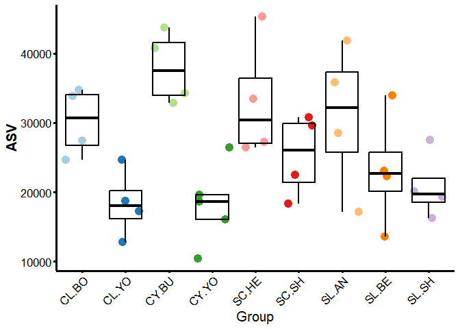
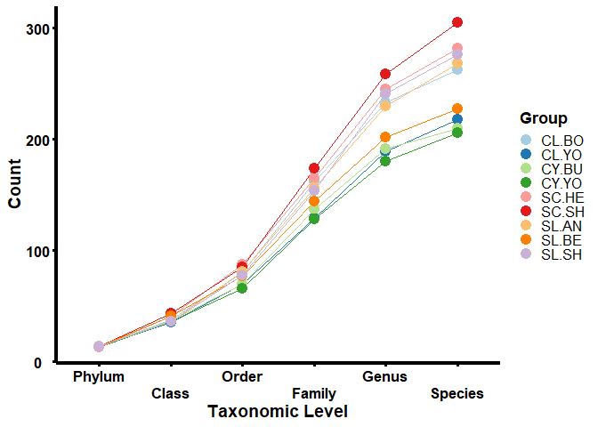
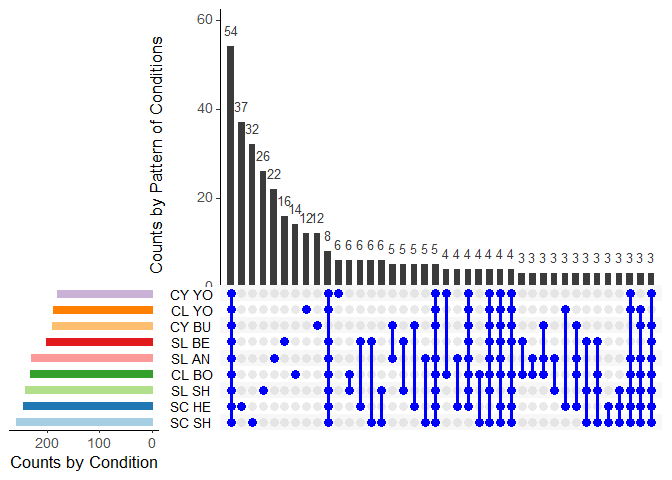
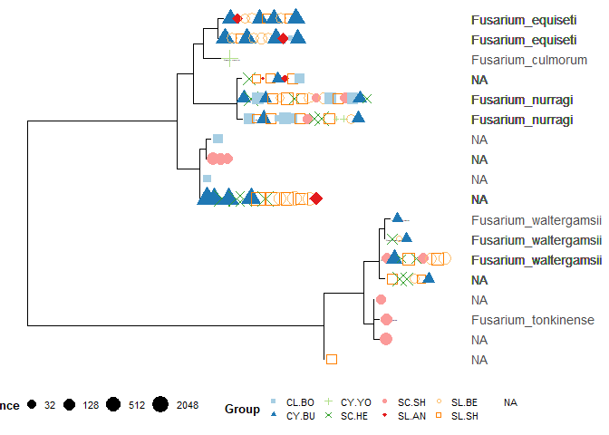
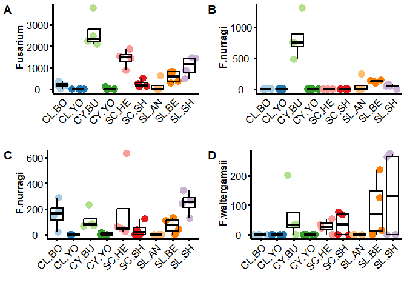

# How-to Guide: Case Study 3 - Investigating Soil-Borne Fungal Diseases in Wheat

The fungi-wheat relationship significantly affects agricultural
ecosystems and productivity. Wheat root rot disease, caused by
soil-borne fungi, leads to major crop losses. This study explores the
link between soil fungal diversity and wheat roots across nine farms to
assess the prevalence of these pathogens.

## Install and load the required packages for the conversion

### Qiime2 to Phyloseq

Converting outcomes from Qiime2 data structure to the phyloseq object
structure in R using Qiim2R package. Also, the phyloseq package provides
functions for organising and manipulating data within the phyloseq
object, allowing for diverse analyses such as diversity assessments,
differential abundance testing, and taxonomic profile visualisation.

    # Download qiime2R from Github
    # if (!requireNamespace("devtools", quietly = TRUE))
    #   install.packages("devtools")
    # devtools::install_github("jbisanz/qiime2R")
    library("qiime2R")

    # Download phyloseq from CRAN
    # if (!require("BiocManager", quietly = TRUE))
    #   install.packages("BiocManager")
    # BiocManager::install("phyloseq")
    library("phyloseq")
    # install.packages("tidyverse")
    library("tidyverse")
    # install.packages("ggpubr")
    library("ggpubr")

### The conversion of Qiime2 to Phyloseq datastructure

    # Convert qiime2 to phyloseq format
    physeq.a <- qza_to_phyloseq(
      features = "C:/ITS/table-its-fungi-with-phyla-no-mitochondria-no-chloroplast.qza", # table.qza
      tree = "C:/ITS/rooted_tree.qza",
      taxonomy = "C:/ITS/taxonomy-fungi.qza",
      metadata = "C:/ITS/ITS-meta-table.txt"
    )
    physeq.a ## confirm the object

    ## phyloseq-class experiment-level object
    ## otu_table()   OTU Table:         [ 3904 taxa and 37 samples ]
    ## sample_data() Sample Data:       [ 37 samples by 7 sample variables ]
    ## tax_table()   Taxonomy Table:    [ 3904 taxa by 7 taxonomic ranks ]
    ## phy_tree()    Phylogenetic Tree: [ 3904 tips and 3878 internal nodes ]

    ## Merge the replicate samples for each Group
    physeq.a.group = merge_samples(physeq.a, "Group") # Sum between replicate samples

    # (3B) repair factors in the sample metadata
    sample_data(physeq.a.group)$Group <- levels(sample_data(physeq.a)$Group)[get_variable(physeq.a.group, "Group")]
    sample_data(physeq.a.group)$Soil.Type <- levels(sample_data(physeq.a)$Soil.Type)[get_variable(physeq.a.group, "Soil.Type")]
    sample_data(physeq.a.group)$Soil <- levels(sample_data(physeq.a)$Soil)[get_variable(physeq.a.group, "Soil")]

### Assessing ASV distribution (merged and filtered)

We evaluated the number of Amplicon Sequence Variants (ASVs) and
visualised the raw read counts per sample within each group. This
provided insights into the distribution of ASVs and the sequencing depth
of each sample, allowing for a comprehensive assessment of data quality
and quantity.

    # install.packages("ggplot2")
    library("ggplot2")
    # install.packages("RColorBrewer")
    library("RColorBrewer")

    # This line is calculating the sum of samples in the physeq.a object and storing it in ASV.
    ASV <- sample_sums(physeq.a)

    # This line is converting ASV into a data frame.
    ASV <- as.data.frame(ASV)

    # This line is adding a new column to the ASV data frame called 'Group', 
    # which is taken from the 'Group' column of the sam_data slot of the physeq.a object.
    ASV$Group <- physeq.a@sam_data$Group

    # The following lines are creating a ggplot. The data used is the ASV data frame. 
    # The x-axis represents the 'Group', and the y-axis represents the 'ASV'. 
    # The colour of the points is determined by the 'Group'.
    ggplot(ASV, aes(x = Group, y = ASV,  colour = Group))+
      # This line is setting the colour palette of the plot to 'Paired'.
      scale_color_brewer(palette = "Paired") +
      # This line is adding jittered points to the plot. 
      # The size of the points is 4, and the transparency level (alpha) is 1 (completely opaque).
      geom_point(alpha = 1, position = "jitter", size = 4) + 
      # This line is adding boxplots to the plot. The boxplots are black and have a size of 0.8. 
      # The boxplots are completely transparent (alpha = 0).
      geom_boxplot(alpha = 0, colour = "black", size = 0.8)+ 
      # This line is setting the theme of the plot to 'classic'.
      theme_classic() + 
      # The following lines are customising various elements of the theme.
      theme(text = element_text(size=15, colour = "black"), 
            axis.ticks = element_line(colour = "black", size = 1.25),
            axis.line = element_line(colour = 'black', size = 1.25),
            axis.text.x = element_text(angle=45, hjust=1, 
                                       colour = "black", size = 13),
            axis.text.y = element_text(angle=0, hjust=0.5, 
                                       colour = "black",size = 13),
            axis.title.y = element_text(color="black", size=15,face="bold"),
            legend.position = "none")

    # This line is removing the ASV object from the workspace to free up memory.
    rm(ASV)

### Beta diversity

Beta diversity is a metric used in microbial community studies to assess
species composition dissimilarity between samples, providing insights
into microbial community dynamics and their ecological significance. By
quantifying variation in community structure and employing visualisation
techniques, beta diversity analysis allows comparisons across habitats
or treatments, revealing key drivers of community variation and
functional implications. It aids our understanding of microbial
assemblages and their responses to environmental changes in ecology,
environmental science, and human health research.

    # method options: NMDS / PCoA
    NMDS <- ordinate(physeq = physeq.a, method = "NMDS", distance = "bray")

    ## Square root transformation
    ## Wisconsin double standardization
    ## Run 0 stress 0.196196 
    ## Run 1 stress 0.1929835 
    ## ... New best solution
    ## ... Procrustes: rmse 0.1085375  max resid 0.2861573 
    ## Run 2 stress 0.2368363 
    ## Run 3 stress 0.1929835 
    ## ... Procrustes: rmse 5.533985e-06  max resid 1.734249e-05 
    ## ... Similar to previous best
    ## Run 4 stress 0.2559646 
    ## Run 5 stress 0.2176466 
    ## Run 6 stress 0.196196 
    ## Run 7 stress 0.2449751 
    ## Run 8 stress 0.2700541 
    ## Run 9 stress 0.2413325 
    ## Run 10 stress 0.196196 
    ## Run 11 stress 0.2110517 
    ## Run 12 stress 0.196196 
    ## Run 13 stress 0.196196 
    ## Run 14 stress 0.2110517 
    ## Run 15 stress 0.2307233 
    ## Run 16 stress 0.2276791 
    ## Run 17 stress 0.1929835 
    ## ... Procrustes: rmse 5.045683e-07  max resid 1.161381e-06 
    ## ... Similar to previous best
    ## Run 18 stress 0.196196 
    ## Run 19 stress 0.196196 
    ## Run 20 stress 0.2365145 
    ## *** Best solution repeated 2 times

    # Plot ordination
    plot_ordination(physeq = physeq.a,
                          ordination = NMDS,
                          color = "Group",
                          shape = "Group"
    ) +
      theme_classic() + 
      scale_color_brewer(palette = "Paired") + 
      scale_fill_brewer(palette = "Paired") + 
      geom_point(aes(color = Group), alpha = 1, size = 3) +
      theme(
        text = element_text(size = 18, colour = "black"), 
        axis.ticks = element_line(colour = "black", size = 1.1),
        axis.line = element_line(colour = 'black', size = 1.1),
        axis.text.x = element_text(colour = "black", angle = 0, hjust = 0.5, 
                                   size = 13, face = "bold"),
        axis.text.y = element_text(colour = "black", angle = 0, hjust = 0.5, 
                                   size = 13, face = "bold"),
        axis.title.y = element_text(color = "black", size = 20, face = "bold"), 
        axis.title.x = element_text(color = "black", size = 20, face = "bold")
      ) + stat_ellipse(geom = "polygon", type="norm", alpha=0.25, aes(fill = Group)) +
      scale_shape_manual(values = c(15, 17, 3, 4, 16, 18, 21, 22, 23)) # Set custom shapes

    # Clean up by removing objects that are no longer needed
    rm(NMDS)

### Alpha diversity

Alpha diversity, a key ecological concept, denotes species richness
within a specific habitat or community. In microbial ecology, it
signifies the variety and distribution of microorganisms in a sample or
microbiome. It’s measured by species richness and evenness, reflecting
the number and distribution of species respectively. Alpha diversity is
vital for assessing the stability and functional potential of microbial
communities and can be influenced by environmental conditions, host
factors, and disturbances. Comparing alpha diversity across samples or
groups allows researchers to understand the effects of factors like
disease or habitat changes on microbial community structure.

Here we use Shannon for alpha diversity.

    ##########  alpha diversity (Shannon)
    # available measurements [c("Observed", "Chao1", "ACE", "Shannon", "Simpson", "InvSimpson", "Fisher")]
    alpha.object <- cbind(
      x = sample_data(physeq.a),
      y = estimate_richness(physeq.a, measures = 'Shannon')
    )

    # Create a plot for alpha diversity
    ggplot(data = alpha.object, aes(x = x.Group, y = Shannon, color = x.Group)) + 
      scale_color_brewer(palette = "Paired") +
      theme_classic() + 
      labs(
        x = element_blank(),                     # No x-axis label
        y = "Alpha Diversity (Shannon)"          # y-axis label
      ) + 
      geom_point(alpha = 1, position = "jitter", size = 4) + 
      geom_boxplot(alpha = 0, colour = "black", size = 0.8)+ 
      theme(
        text = element_text(size = 18, colour = "black"), 
        axis.ticks = element_line(colour = "black", size = 1.1),
        axis.line = element_line(colour = 'black', size = 1.1),
        axis.text.x = element_text(colour = "black", angle = 45, 
                                   hjust = 1, size = 13, face = "bold"),
        axis.text.y = element_text(angle = 0, hjust = 0, 
                                   colour = "black", size = 13, face = "bold"),
        axis.title.y = element_text(color = "black", size = 15, face = "bold"),
        legend.position = "none"                 # Hide legend
      ) 

    # Clean up by removing the alpha.object
    rm(alpha.object)

#### Number of taxa in groups

Examining the cumulative count of taxa within a particular taxonomic
group for each distinct subgroup involves the summation of the total
number of taxa within that group while eliminating any overlapping taxa
based on their names within individual subgroups. This process aids in
comprehending the dynamics of microbiome populations.

    library("dplyr")
    library("reshape2")

    physeq <- merge_samples(physeq.a, "Group", fun = sum)
    gentab_levels <- list()
    observationThreshold <- 1

    # Define the taxonomic levels
    genus_levels <- c("Phylum", "Class", "Order", "Family", "Genus", "Species")

    # Something wrong with Kingdom Level, removed from the analysis 
    # loop through all the taxonomic levels
      for (level in genus_levels) {
        
        # create a factor variable for each level
        genfac <- factor(tax_table(physeq)[, level])
        
        # calculate the abundance of each genus within each sample
        gentab <- apply(otu_table(physeq), MARGIN = 1, function(x) {
          tapply(x, INDEX = genfac, FUN = sum, na.rm = TRUE, simplify = TRUE)
        })
        
        # calculate the number of samples in which each genus is observed above the threshold
        level_counts <- apply(gentab > observationThreshold, 2, sum)
        
        # create a data frame of level counts with genus names as row names
        BB <- as.data.frame(level_counts)
        BB$Group <- row.names(BB)
        
        # add the data frame to the gentab_levels list
        gentab_levels[[level]] <- BB
      }

    # Combine all level counts data frames into one data frame
    B2 <- gentab_levels %>% reduce(full_join, by = "Group")
      
    # Set row names and column names
    row.names(B2) <- B2$Group
    B2$Group <- NULL
    colnames(B2)[1:6] <- genus_levels

    print(B2)

    ##       Phylum Class Order Family Genus Species
    ## CL.BO     14    38    80    162   233     263
    ## CL.YO     14    35    70    129   189     218
    ## CY.BU     14    37    70    137   191     210
    ## CY.YO     13    36    66    128   180     206
    ## SC.HE     13    41    87    165   245     282
    ## SC.SH     14    43    85    174   259     305
    ## SL.AN     14    36    81    156   230     268
    ## SL.BE     14    41    77    144   202     227
    ## SL.SH     14    36    78    154   241     276

    # write.csv(B2, file = "ITS/level_counts_by_group.csv", row.names = TRUE)
    B2$Group = row.names(B2)
    data_long <- melt(B2)
    data_long <- melt(B2, id.vars = "Group", 
                      variable.name = "Level", 
                      value.name = "Taxa")

    # Plot the data as a line graph using ggplot
    ggplot(data_long, aes(x = Level, y = Taxa, 
                          color = Group, group = Group)) +
      geom_line() +
      geom_point(size = 4) +
      labs(x = "Taxonomic Level", y = "Count", color = "Group") +
      theme_classic() +   scale_color_brewer(palette = "Paired") +
      theme(
        text = element_text(size = 19, colour = "black"), 
        axis.ticks = element_line(colour = "black", size = 1.1),
        axis.line = element_line(colour = 'black', size = 1.5),
        axis.text.x = element_text(colour = "black", angle = 0, hjust = 0.5, 
                                   size = 13, face = "bold"),
        axis.text.y = element_text(colour = "black", angle = 0, hjust = 0.5, 
                                   size = 13, face = "bold"),
        axis.title.y = element_text(color = "black", size = 14, face = "bold"), 
        axis.title.x = element_text(color = "black", size = 14, face = "bold"),
        legend.title = element_text(size = 13.5, face = "bold"),
        legend.text = element_text(size = 12),
        legend.key.size=unit(0.4,"cm")
      ) +
      scale_x_discrete(guide = guide_axis(n.dodge=2)) +
      scale_y_continuous(breaks=seq(0,400,by=100))

    # Clean up by removing the alpha.object
    rm(physeq, gentab_levels, observationThreshold, B2, data_long, genfac, genus_levels, level, level_counts)

### Upset plot using UpsetR

Venn diagrams are commonly used for visualizing sets, but they can
become complex with more than five sets. UpSet graphs, on the other
hand, offer a more efficient way to display intersections and
complements, especially for larger or multiple datasets. They provide a
more intuitive and informative data representation.

    library("UpSetR")
    library("reshape2")
    library("plyr")
    library("dplyr")
    # BiocManager::install("microbiome")
    library("microbiome")

    # Aggregate taxa at the genus level
    B <- aggregate_taxa(physeq.a.group, "Genus", verbose = TRUE)

    ## [1] "Remove taxonomic information below the target level"
    ## [1] "Mark the potentially ambiguous taxa"
    ## [1] "-- split"
    ## [1] "-- sum"
    ## [1] "Create phyloseq object"
    ## [1] "Remove ambiguous levels"
    ## [1] "-- unique"
    ## [1] "-- Rename the lowest level"
    ## [1] "-- rownames"
    ## [1] "-- taxa"
    ## [1] "Convert to taxonomy table"
    ## [1] "Combine OTU and Taxon matrix into Phyloseq object"
    ## [1] "Add the metadata as is"

    # Remove undesired genera
    # B2 <- subset_taxa(B, !get("Genus") %in% c("uncultured", "Unknown"))

    # Remove unwanted taxon names
    taxa_to_remove <- c("uncultured", "Unknown")
    B2 <- subset_taxa(B, !get("Genus") %in% taxa_to_remove)

    # Extract relevant data from the phyloseq object
    sample_data <- sample_data(B2)
    otu_table <- otu_table(B2)
    abundance <- as.vector(otu_table)

    # Create a tibble with the extracted data
    D <- tibble(
      Sample = rep(sample_data$Group, each = nrow(otu_table)),
      ASV = rep(rownames(otu_table), times = ncol(otu_table)),
      Abundance = abundance
    ) %>%
      group_by(Sample) %>%
      mutate(rank = rank(desc(Abundance))) %>%
       filter(Abundance > 0) %>%
      ungroup() %>%
      select(Sample, Abundance, ASV)

    # Remove the Abundance column
    D$Abundance <- NULL

    # Rename the second column to "ASV"
    names(D)[2] <- "ASV"
    names(D)[1] <- "Group"

    # Convert data from long to wide format
    E <- dcast(D, ASV ~ Group)

    # Define a binary function
    binary_fun <- function(x) {
      x[is.na(x)] <- 0
      ifelse(x > 0, 1, 0)
    }

    col = brewer.pal(n = 9, name = "Paired")

    # Apply the binary function to columns 2 to 10
    temp_df <- apply(E[2:10], 2, binary_fun)
    temp_df <- as.data.frame(temp_df)

    # Create an UpSet plot
    upset_plot <- upset(temp_df, 
                        sets = colnames(temp_df), 
                        sets.bar.color = (col),
                        order.by = "freq", 
                        empty.intersections = "on",
                        mainbar.y.label = "Counts by Pattern of Conditions", 
                        sets.x.label = "Counts by Condition",
                        matrix.color="blue", 
                        mb.ratio = c(0.6, 0.4),
                        point.size= 2.75,
                        line.size = 1.25, 
                        text.scale = 1.5
    )

    # Print the UpSet plot
    print(upset_plot)

### Phylogenetic tree

Phylogenetic trees are branching diagrams that show the evolutionary
relationships between different species or other entities. They are
constructed by comparing the organisms’ DNA, proteins, or other
features. The more similar the features, the more closely related the
organisms are thought to be. It can be used to answer how different
species are related to each other, when different species diverged from
each other, and what are the common ancestors of different species.

Here, we concentrate on *Fusarium*, a large genus of filamentous fungi.
These fungi, often referred to as hyphomycetes, are widely found in soil
and are associated with plants. While most species are harmless saprobes
and form a significant part of the soil microbial community, some can
produce mycotoxins in cereal crops that can harm human and animal health
if they enter the food chain. Despite the majority of species being
harmless, certain Fusarium species and subspecific groups rank among the
most critical fungal pathogens of plants and animals.

    # Load required libraries
    library("phyloseq")   # For handling phylogenetic sequencing data
    # BiocManager::install("ggtree")
    library("ggtree")     # For tree visualisation
    library("scales")     # For scaling transformations

    # Load the GlobalPatterns dataset and prune taxa
    GP <- prune_taxa(taxa_sums(physeq.a) > 0, physeq.a)  # Remove taxa with zero sums
    GP.chl <- subset_taxa(GP, Genus == "Fusarium")   # Subset data based on Phylum value

    # Create a ggtree plot
    p <- ggtree(GP.chl, ladderize = TRUE) +
      # geom_text2(aes(subset = !isTip, label = label), hjust = -1.5, size = 3.5) +
      geom_tiplab(aes(label = Species), as_ylab=TRUE) +
      geom_point(aes(x = x + hjust, color = Group, 
                     shape = Group, size = Abundance), na.rm = TRUE) +
      scale_size_continuous(trans = log_trans(2)) +
      scale_shape_manual(values = c(15, 17, 3, 4, 16, 18, 21, 22, 23)) + # Set custom
      scale_color_brewer(palette = "Paired") +
      theme(text = element_text(size=13, colour = "black"), 
            axis.ticks = element_line(colour = "black", size = 1.25),
            axis.line = element_line(colour = 'black', size = 1.25) ,
            axis.title.y = element_text(color="black", size=2.5,face="bold"), 
            legend.text = element_text(size = 8),
            legend.key.size=unit(0.4,"cm"),
            legend.title = element_text(size = 10, face = "bold"),
            legend.position = "bottom"
      ) 

    # Print the ggtree plot
    print(p)

From the phylogenetic tree, it was obsered *Fusarium culmorum* and
*Fusarium tonkinense* were identified in only one of the samples.
However, there was an enrichment of *Fusarium equiseti* , *Fusarium
nurragi and Fusarium waltergamsii.*

-   *Fusarium equiseti* is a fungal species and plant pathogen on a
    varied range of crops. It is considered to be a weak pathogen on
    cereals and is occasionally found to be associated with ‘Fusarium
    head blight’ infected kernels. It is commonly found in tropical and
    subtropical areas.

-   *Fusarium nurragi* has been isolated from heath species growing on
    the coasts in the Australian states of Victoria and Western
    Australia. Although *F. nurragi* has not been assigned to a Fusarium
    species complex, it is closely related to the *F. heterosporum* and
    *F. tricinctum* species complexes.

-   *Fusarium waltergamsii* is a fungal species that was first isolated
    from the roots of wheat plants in Germany. It belongs to the
    *Fusarium oxysporum* species complex, which comprises many plant
    pathogens and opportunistic animal pathogens. *Fusarium
    waltergamsii* can cause wilt and root rot diseases in wheat and
    other cereals, reducing crop yield and quality.

<!-- -->

    # Plotting for the abundance of one specific fungi
    # Subset the taxa to Genus from physeq.wheat 
    physeq.a.genus <- subset_taxa(physeq.a, Genus == "Fusarium")
    physeq.a.equiseti <- subset_taxa(physeq.a, Species == "Fusarium_equiseti")
    physeq.a.nurragi <- subset_taxa(physeq.a, Species == "Fusarium_nurragi")
    physeq.a.waltergamsii <- subset_taxa(physeq.a, Species == "Fusarium_waltergamsii")

    # Calculate the total abundance of Fusarium for each sample
    meta = physeq.a@sam_data
    otudf = as.data.frame(t(as.data.frame(physeq.a.genus@otu_table)))
    meta$Fusarium = rowSums(otudf)
    otudf = as.data.frame(t(as.data.frame(physeq.a.equiseti@otu_table)))
    meta$F.equiseti = rowSums(otudf)
    otudf = as.data.frame(t(as.data.frame(physeq.a.nurragi@otu_table)))
    meta$F.nurragi = rowSums(otudf)
    otudf = as.data.frame(t(as.data.frame(physeq.a.waltergamsii@otu_table)))
    meta$F.waltergamsii = rowSums(otudf)

    # Plot a graph of the abundance of Fusarium for each sample grouped by Group:
    p1 <- ggplot(subset(meta, Group %in% c("CL.BO","CL.YO",
                                           "CY.BU","CY.YO",
                                           "SC.HE","SC.SH",
                                           "SL.AN","SL.BE",
                                           "SL.SH")),
                 aes(x = Group, y = Fusarium,  colour = interaction(Group))) +
      geom_point(alpha = 1, position = "jitter", size = 4) + 
      geom_boxplot(alpha = 0, colour = "black", size = 0.8)+ 
      theme_classic() +   scale_color_brewer(palette = "Paired") +
      labs(x = "", y = "\n Fusarium") +
      theme(text = element_text(size=15, colour = "black"), 
            axis.ticks = element_line(colour = "black", size = 1.25),
            axis.line = element_line(colour = 'black', size = 1.25),
            axis.text.x = element_text(angle=45, hjust=1, 
                                       colour = "black", size = 13),
            axis.text.y = element_text(angle=0, hjust=0.5, 
                                       colour = "black",size = 13),
            axis.title.y = element_text(color="black", size=12,face="bold"), 
            legend.position = "none")

    p2 <- ggplot(subset(meta, Group %in% c("CL.BO","CL.YO",
                                           "CY.BU","CY.YO",
                                           "SC.HE","SC.SH",
                                           "SL.AN","SL.BE",
                                           "SL.SH")),
                 aes(x = Group, y = F.equiseti,  colour = interaction(Group))) +
      geom_point(alpha = 1, position = "jitter", size = 4) + 
      geom_boxplot(alpha = 0, colour = "black", size = 0.8)+ 
      theme_classic() +   scale_color_brewer(palette = "Paired") +
      labs(x = "", y = "\n F.nurragi") +
      theme(text = element_text(size=15, colour = "black"), 
            axis.ticks = element_line(colour = "black", size = 1.25),
            axis.line = element_line(colour = 'black', size = 1.25),
            axis.text.x = element_text(angle=45, hjust=1, 
                                       colour = "black", size = 13),
            axis.text.y = element_text(angle=0, hjust=0.5, 
                                       colour = "black",size = 13),
            axis.title.y = element_text(color="black", size=12,face="bold"), 
            legend.position = "none")

    p3 <- ggplot(subset(meta, Group %in% c("CL.BO","CL.YO",
                                           "CY.BU","CY.YO",
                                           "SC.HE","SC.SH",
                                           "SL.AN","SL.BE",
                                           "SL.SH")),
                 aes(x = Group, y = F.nurragi,  colour = interaction(Group))) +
      geom_point(alpha = 1, position = "jitter", size = 4) + 
      geom_boxplot(alpha = 0, colour = "black", size = 0.8)+ 
      theme_classic() +   scale_color_brewer(palette = "Paired") +
      labs(x = "", y = "\n F.nurragi") +
      theme(text = element_text(size=15, colour = "black"), 
            axis.ticks = element_line(colour = "black", size = 1.25),
            axis.line = element_line(colour = 'black', size = 1.25),
            axis.text.x = element_text(angle=45, hjust=1, 
                                       colour = "black", size = 13),
            axis.text.y = element_text(angle=0, hjust=0.5, 
                                       colour = "black",size = 13),
            axis.title.y = element_text(color="black", size=12,face="bold"), 
            legend.position = "none")

    p4 <- ggplot(subset(meta, Group %in% c("CL.BO","CL.YO",
                                           "CY.BU","CY.YO",
                                           "SC.HE","SC.SH",
                                           "SL.AN","SL.BE",
                                           "SL.SH")),
                 aes(x = Group, y = F.waltergamsii,  colour = interaction(Group))) +
      geom_point(alpha = 1, position = "jitter", size = 4) + 
      geom_boxplot(alpha = 0, colour = "black", size = 0.8)+ 
      theme_classic() +   scale_color_brewer(palette = "Paired") +
      labs(x = "", y = "\n F.waltergamsii") +
      theme(text = element_text(size=15, colour = "black"), 
            axis.ticks = element_line(colour = "black", size = 1.25),
            axis.line = element_line(colour = 'black', size = 1.25),
            axis.text.x = element_text(angle=45, hjust=1, 
                                       colour = "black", size = 13),
            axis.text.y = element_text(angle=0, hjust=0.5, 
                                       colour = "black",size = 13),
            axis.title.y = element_text(color="black", size=12,face="bold"), 
            legend.position = "none") 

    # Combine and Arrange the plots
    fig <- ggarrange(p1, p2, p3, p4, labels = c("A", "B", "C", "D"), size = 8,
                     ncol = 2, nrow = 2)

    # Add labels
    fig <- annotate_figure(fig)

    # Print the figure
    print(fig)

    ## 
    ## attr(,"class")
    ## [1] "list"      "ggarrange"

    sessionInfo()

    ## R version 4.3.2 (2023-10-31 ucrt)
    ## Platform: x86_64-w64-mingw32/x64 (64-bit)
    ## Running under: Windows 11 x64 (build 22631)
    ## 
    ## Matrix products: default
    ## 
    ## 
    ## locale:
    ## [1] LC_COLLATE=English_United Kingdom.utf8 
    ## [2] LC_CTYPE=English_United Kingdom.utf8   
    ## [3] LC_MONETARY=English_United Kingdom.utf8
    ## [4] LC_NUMERIC=C                           
    ## [5] LC_TIME=English_United Kingdom.utf8    
    ## 
    ## time zone: Europe/London
    ## tzcode source: internal
    ## 
    ## attached base packages:
    ## [1] stats     graphics  grDevices utils     datasets  methods   base     
    ## 
    ## other attached packages:
    ##  [1] scales_1.3.0       ggtree_3.8.2       microbiome_1.22.0  plyr_1.8.9        
    ##  [5] UpSetR_1.4.0       reshape2_1.4.4     RColorBrewer_1.1-3 ggpubr_0.6.0      
    ##  [9] lubridate_1.9.3    forcats_1.0.0      stringr_1.5.1      dplyr_1.1.4       
    ## [13] purrr_1.0.2        readr_2.1.5        tidyr_1.3.1        tibble_3.2.1      
    ## [17] ggplot2_3.4.4      tidyverse_2.0.0    phyloseq_1.44.0    qiime2R_0.99.6    
    ## 
    ## loaded via a namespace (and not attached):
    ##   [1] rstudioapi_0.15.0       jsonlite_1.8.8          magrittr_2.0.3         
    ##   [4] NADA_1.6-1.1            farver_2.1.1            rmarkdown_2.25         
    ##   [7] fs_1.6.3                zlibbioc_1.48.0         vctrs_0.6.5            
    ##  [10] multtest_2.56.0         memoise_2.0.1           RCurl_1.98-1.14        
    ##  [13] base64enc_0.1-3         rstatix_0.7.2           htmltools_0.5.7        
    ##  [16] truncnorm_1.0-9         broom_1.0.5             Rhdf5lib_1.24.2        
    ##  [19] Formula_1.2-5           rhdf5_2.46.1            gridGraphics_0.5-1     
    ##  [22] htmlwidgets_1.6.4       cachem_1.0.8            igraph_2.0.2           
    ##  [25] lifecycle_1.0.4         iterators_1.0.14        pkgconfig_2.0.3        
    ##  [28] Matrix_1.6-5            R6_2.5.1                fastmap_1.1.1          
    ##  [31] GenomeInfoDbData_1.2.11 digest_0.6.33           aplot_0.2.2            
    ##  [34] colorspace_2.1-0        patchwork_1.2.0         S4Vectors_0.40.2       
    ##  [37] Hmisc_5.1-1             vegan_2.6-4             labeling_0.4.3         
    ##  [40] fansi_1.0.6             timechange_0.3.0        abind_1.4-5            
    ##  [43] mgcv_1.9-0              compiler_4.3.2          withr_3.0.0            
    ##  [46] htmlTable_2.4.2         backports_1.4.1         carData_3.0-5          
    ##  [49] highr_0.10              ggsignif_0.6.4          MASS_7.3-60            
    ##  [52] biomformat_1.30.0       permute_0.9-7           tools_4.3.2            
    ##  [55] foreign_0.8-85          ape_5.7-1               nnet_7.3-19            
    ##  [58] glue_1.7.0              nlme_3.1-163            rhdf5filters_1.14.1    
    ##  [61] grid_4.3.2              checkmate_2.3.1         Rtsne_0.17             
    ##  [64] cluster_2.1.4           ade4_1.7-22             generics_0.1.3         
    ##  [67] gtable_0.3.4            tzdb_0.4.0              data.table_1.15.0      
    ##  [70] hms_1.1.3               car_3.1-2               utf8_1.2.4             
    ##  [73] XVector_0.42.0          BiocGenerics_0.48.1     foreach_1.5.2          
    ##  [76] pillar_1.9.0            yulab.utils_0.1.4       splines_4.3.2          
    ##  [79] treeio_1.26.0           lattice_0.21-9          survival_3.5-7         
    ##  [82] tidyselect_1.2.0        Biostrings_2.70.2       knitr_1.45             
    ##  [85] gridExtra_2.3           IRanges_2.36.0          zCompositions_1.5.0-1  
    ##  [88] stats4_4.3.2            xfun_0.40               Biobase_2.62.0         
    ##  [91] DT_0.31                 stringi_1.8.3           lazyeval_0.2.2         
    ##  [94] ggfun_0.1.4             yaml_2.3.7              evaluate_0.23          
    ##  [97] codetools_0.2-19        ggplotify_0.1.2         cli_3.6.1              
    ## [100] rpart_4.1.21            munsell_0.5.0           Rcpp_1.0.12            
    ## [103] GenomeInfoDb_1.38.6     parallel_4.3.2          bitops_1.0-7           
    ## [106] tidytree_0.4.6          crayon_1.5.2            rlang_1.1.1            
    ## [109] cowplot_1.1.3
